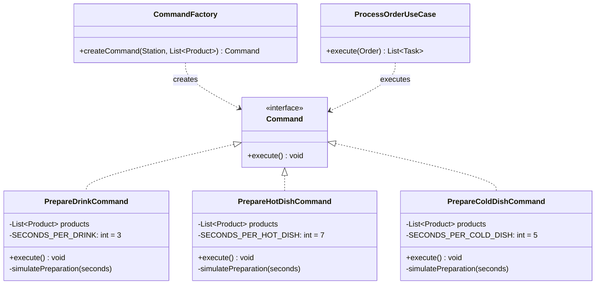
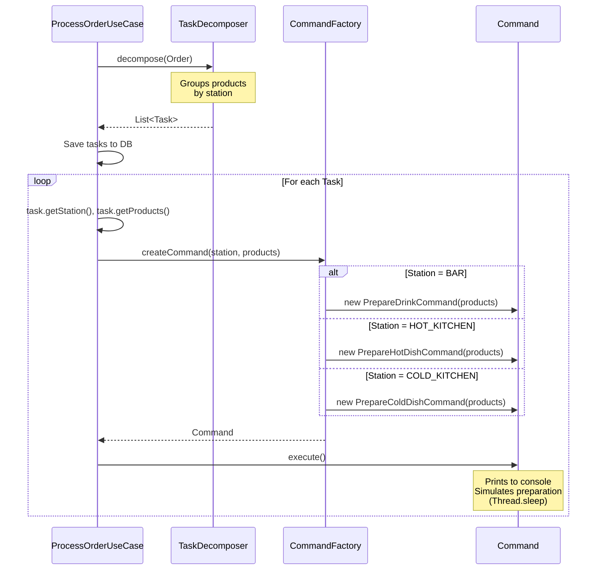

## What is the Command Pattern?

The Command Pattern **encapsulates a request as an object**, allowing you to:

- **Decouple** the invoker (who requests an action) from the receiver (who performs it)
- **Queue** operations for later execution
- **Parameterize** objects with operations
- **Log** and audit operations
- **Support undo/redo** (future enhancement)

<Tip>
Think of commands as "frozen actions" - you create an object that knows how to perform a specific operation, then you can pass it around, store it, or execute it whenever needed.
</Tip>

## Why Use Command Pattern Here?

In FoodTech Kitchen Service, each **kitchen station** has different preparation workflows:

<CardGroup cols={3}>
  <Card title="BAR Station" icon="martini-glass">
    - Prepare drinks
    - 3 seconds each
    - Can be parallelized
  </Card>
  
  <Card title="Hot Kitchen" icon="fire">
    - Cook hot dishes
    - 7 seconds each
    - Sequential cooking
  </Card>
  
  <Card title="Cold Kitchen" icon="salad">
    - Assemble cold dishes
    - 5 seconds each
    - Fresh handling
  </Card>
</CardGroup>

**The Command Pattern allows us to:**

1. **Encapsulate** station-specific logic in separate command classes
2. **Execute** preparation without the caller knowing station details
3. **Extend** easily - add new stations by creating new commands (Open/Closed Principle)

## Command Pattern Structure



<Note>
The key insight: `ProcessOrderUseCase` only knows about the `Command` interface, not the concrete implementations.
</Note>

## Implementation

### Step 1: Define the Command Interface

<Steps>
  <Step title="Simple, focused interface">
    ```java src/main/java/com/foodtech/kitchen/domain/commands/Command.java
    package com.foodtech.kitchen.domain.commands;

    public interface Command {
        void execute();
    }
    ```
    
    <Accordion title="Why only one method?">
    **Design Decision**: We keep the interface minimal for several reasons:
    
    - ✅ **Encapsulation**: Hide implementation details completely
    - ✅ **Interface Segregation Principle**: Minimal contract
    - ✅ **Flexibility**: Commands can have any internal structure
    - ✅ **Separation**: `Task` holds state, `Command` holds behavior
    
    This makes `Task` and `Command` independent:
    - **`Task`**: Domain entity with lifecycle (PENDING → IN_PREPARATION → COMPLETED)
    - **`Command`**: Stateless behavior object that executes an action
    </Accordion>
  </Step>
</Steps>

### Step 2: Implement Concrete Commands

<Accordion title="PrepareDrinkCommand - BAR Station">
  ```java src/main/java/com/foodtech/kitchen/domain/commands/PrepareDrinkCommand.java
  package com.foodtech.kitchen.domain.commands;

  import com.foodtech.kitchen.domain.model.Product;
  import java.util.ArrayList;
  import java.util.List;

  public class PrepareDrinkCommand implements Command {
      private static final int SECONDS_PER_DRINK = 3;

      private final List<Product> products;

      public PrepareDrinkCommand(List<Product> products) {
          // Defensive copy - prevent external modifications
          this.products = new ArrayList<>(products);
      }

      @Override
      public void execute() {
          System.out.println("\n[BAR] 🍹 Starting preparation of " + 
                           products.size() + " drink(s)");

          int totalTime = 0;
          for (int i = 0; i < products.size(); i++) {
              Product product = products.get(i);
              System.out.println("[BAR] Preparing drink " + (i + 1) + "/" + 
                               products.size() + ": " + product.getName());

              simulatePreparation(SECONDS_PER_DRINK);
              totalTime += SECONDS_PER_DRINK;

              System.out.println("[BAR] ✓ " + product.getName() + " ready!");
          }

          System.out.println("[BAR] ✅ All drinks completed in " + 
                           totalTime + " seconds\n");
      }

      private void simulatePreparation(int seconds) {
          try {
              Thread.sleep(seconds * 1000L);
          } catch (InterruptedException e) {
              Thread.currentThread().interrupt();
              throw new RuntimeException("Drink preparation interrupted", e);
          }
      }
  }
  ```
  
  **Key Design Points:**
  
  <CardGroup cols={2}>
    <Card title="Defensive Copy" icon="shield">
      `new ArrayList<>(products)` prevents external modifications
    </Card>
    
    <Card title="Immutable State" icon="lock">
      Products list is `final` - command state cannot change after creation
    </Card>
    
    <Card title="Self-Contained" icon="box">
      All logic for drink preparation is in one place
    </Card>
    
    <Card title="Simulated Time" icon="clock">
      `Thread.sleep()` simulates real-world preparation time
    </Card>
  </CardGroup>
</Accordion>

<Accordion title="PrepareHotDishCommand - Hot Kitchen">
  ```java src/main/java/com/foodtech/kitchen/domain/commands/PrepareHotDishCommand.java
  public class PrepareHotDishCommand implements Command {
      private static final int SECONDS_PER_HOT_DISH = 7;

      private final List<Product> products;

      public PrepareHotDishCommand(List<Product> products) {
          this.products = new ArrayList<>(products);
      }

      @Override
      public void execute() {
          System.out.println("\n[HOT_KITCHEN] 🔥 Starting preparation of " + 
                           products.size() + " hot dish(es)");

          int totalTime = 0;
          for (int i = 0; i < products.size(); i++) {
              Product product = products.get(i);
              System.out.println("[HOT_KITCHEN] Cooking dish " + (i + 1) + "/" + 
                               products.size() + ": " + product.getName());

              simulatePreparation(SECONDS_PER_HOT_DISH);
              totalTime += SECONDS_PER_HOT_DISH;

              System.out.println("[HOT_KITCHEN] ✓ " + product.getName() + " ready!");
          }

          System.out.println("[HOT_KITCHEN] ✅ All hot dishes completed in " + 
                           totalTime + " seconds\n");
      }

      private void simulatePreparation(int seconds) {
          try {
              Thread.sleep(seconds * 1000L);
          } catch (InterruptedException e) {
              Thread.currentThread().interrupt();
              throw new RuntimeException("Hot dish preparation interrupted", e);
          }
      }
  }
  ```
  
  <Note>
  Hot dishes take **7 seconds** each - longer than drinks because cooking requires more time.
  </Note>
</Accordion>

<Accordion title="PrepareColdDishCommand - Cold Kitchen">
  ```java src/main/java/com/foodtech/kitchen/domain/commands/PrepareColdDishCommand.java
  public class PrepareColdDishCommand implements Command {
      private static final int SECONDS_PER_COLD_DISH = 5;

      private final List<Product> products;

      public PrepareColdDishCommand(List<Product> products) {
          this.products = new ArrayList<>(products);
      }

      @Override
      public void execute() {
          System.out.println("\n[COLD_KITCHEN] 🥗 Starting preparation of " + 
                           products.size() + " cold dish(es)");

          int totalTime = 0;
          for (int i = 0; i < products.size(); i++) {
              Product product = products.get(i);
              System.out.println("[COLD_KITCHEN] Preparing dish " + (i + 1) + "/" + 
                               products.size() + ": " + product.getName());

              simulatePreparation(SECONDS_PER_COLD_DISH);
              totalTime += SECONDS_PER_COLD_DISH;

              System.out.println("[COLD_KITCHEN] ✓ " + product.getName() + " ready!");
          }

          System.out.println("[COLD_KITCHEN] ✅ All cold dishes completed in " + 
                           totalTime + " seconds\n");
      }

      private void simulatePreparation(int seconds) {
          try {
              Thread.sleep(seconds * 1000L);
          } catch (InterruptedException e) {
              Thread.currentThread().interrupt();
              throw new RuntimeException("Cold dish preparation interrupted", e);
          }
      }
  }
  ```
  
  <Tip>
  Cold dishes take **5 seconds** - faster than hot dishes but slower than drinks.
  </Tip>
</Accordion>

### Step 3: Command Factory

The **Factory Pattern** creates the appropriate command based on the station.

```java src/main/java/com/foodtech/kitchen/domain/services/CommandFactory.java
package com.foodtech.kitchen.domain.services;

import com.foodtech.kitchen.domain.commands.*;
import com.foodtech.kitchen.domain.model.Product;
import com.foodtech.kitchen.domain.model.Station;
import java.util.List;

public class CommandFactory {

    public Command createCommand(Station station, List<Product> products) {
        return switch (station) {
            case BAR -> new PrepareDrinkCommand(products);
            case HOT_KITCHEN -> new PrepareHotDishCommand(products);
            case COLD_KITCHEN -> new PrepareColdDishCommand(products);
        };
    }
}
```

<CardGroup cols={2}>
  <Card title="Why Factory?" icon="industry">
    **Benefits:**
    - ✅ Centralizes command creation logic
    - ✅ Single Responsibility: factory creates, use cases orchestrate
    - ✅ Open/Closed: Add new station = add case + new command class
    - ✅ Testable: Can test command creation in isolation
  </Card>
  
  <Card title="Modern Java Switch" icon="code">
    Using Java 17+ **switch expressions**:
    - Exhaustive (compiler ensures all cases)
    - No break statements needed
    - Returns value directly
  </Card>
</CardGroup>

### Step 4: Command Execution Flow

Let's trace how commands are created and executed:



<Note>
**Important**: The use case doesn't know which concrete command it's executing - it only calls `execute()` on the interface.
</Note>

## Real-World Example

Let's walk through a complete order:

<Steps>
  <Step title="Customer places order">
    ```json
    POST /api/orders
    {
      "tableNumber": "A1",
      "products": [
        {"name": "Coca Cola", "type": "DRINK"},
        {"name": "Sprite", "type": "DRINK"},
        {"name": "Pizza Margherita", "type": "HOT_DISH"},
        {"name": "Caesar Salad", "type": "COLD_DISH"}
      ]
    }
    ```
  </Step>
  
  <Step title="TaskDecomposer groups by station">
    The system automatically groups products:
    
    | Station | Products |
    |---------|----------|
    | **BAR** | Coca Cola, Sprite |
    | **HOT_KITCHEN** | Pizza Margherita |
    | **COLD_KITCHEN** | Caesar Salad |
    
    Creates 3 tasks (one per station).
  </Step>
  
  <Step title="CommandFactory creates commands">
    For each task, creates the appropriate command:
    
    ```java
    // Task 1: BAR station with 2 drinks
    Command drinkCmd = new PrepareDrinkCommand(
        List.of(cocaCola, sprite)
    );
    
    // Task 2: HOT_KITCHEN station with 1 hot dish
    Command hotCmd = new PrepareHotDishCommand(
        List.of(pizza)
    );
    
    // Task 3: COLD_KITCHEN station with 1 cold dish
    Command coldCmd = new PrepareColdDishCommand(
        List.of(salad)
    );
    ```
  </Step>
  
  <Step title="Commands execute">
    Console output shows the preparation:
    
    ```
    [BAR] 🍹 Starting preparation of 2 drink(s)
    [BAR] Preparing drink 1/2: Coca Cola
    [BAR] ✓ Coca Cola ready!
    [BAR] Preparing drink 2/2: Sprite
    [BAR] ✓ Sprite ready!
    [BAR] ✅ All drinks completed in 6 seconds

    [HOT_KITCHEN] 🔥 Starting preparation of 1 hot dish(es)
    [HOT_KITCHEN] Cooking dish 1/1: Pizza Margherita
    [HOT_KITCHEN] ✓ Pizza Margherita ready!
    [HOT_KITCHEN] ✅ All hot dishes completed in 7 seconds

    [COLD_KITCHEN] 🥗 Starting preparation of 1 cold dish(es)
    [COLD_KITCHEN] Preparing dish 1/1: Caesar Salad
    [COLD_KITCHEN] ✓ Caesar Salad ready!
    [COLD_KITCHEN] ✅ All cold dishes completed in 5 seconds
    ```
    
    **Total time**: 6 + 7 + 5 = **18 seconds**
  </Step>
</Steps>

## Benefits of Command Pattern

<CardGroup cols={2}>
  <Card title="Decoupling" icon="link-slash">
    Use case doesn't know station details - only calls `execute()`
  </Card>
  
  <Card title="Extensibility" icon="plus">
    Add `DESSERT` station:
    1. Create `PrepareDessertCommand`
    2. Add case in factory
    3. No changes to existing code
  </Card>
  
  <Card title="Testability" icon="vial">
    Test each command independently:
    ```java
    @Test
    void testDrinkCommand() {
        Command cmd = new PrepareDrinkCommand(
            List.of(new Product("Cola", DRINK))
        );
        assertDoesNotThrow(() -> cmd.execute());
    }
    ```
  </Card>
  
  <Card title="Encapsulation" icon="box">
    All BAR logic is in `PrepareDrinkCommand` - single place to change
  </Card>
</CardGroup>

## Advanced: Command Executor

For even better separation, we can introduce a **CommandExecutor**:

```java src/main/java/com/foodtech/kitchen/application/ports/out/CommandExecutor.java
package com.foodtech.kitchen.application.ports.out;

import com.foodtech.kitchen.domain.commands.Command;
import java.util.List;

public interface CommandExecutor {
    void execute(Command command);
    void executeAll(List<Command> commands);
}
```

### Synchronous Executor

```java src/main/java/com/foodtech/kitchen/infrastructure/execution/SyncCommandExecutor.java
@Component
public class SyncCommandExecutor implements CommandExecutor {
    
    @Override
    public void execute(Command command) {
        if (command == null) {
            throw new IllegalArgumentException("Command cannot be null");
        }
        command.execute();
    }
    
    @Override
    public void executeAll(List<Command> commands) {
        if (commands == null || commands.isEmpty()) {
            return;
        }
        commands.forEach(this::execute);
    }
}
```

### Future: Async Executor

```java
@Component
public class AsyncCommandExecutor implements CommandExecutor {
    private final ExecutorService executorService;
    
    public AsyncCommandExecutor() {
        this.executorService = Executors.newFixedThreadPool(3);
    }
    
    @Override
    public void execute(Command command) {
        executorService.submit(command::execute);
    }
    
    @Override
    public void executeAll(List<Command> commands) {
        List<CompletableFuture<Void>> futures = commands.stream()
            .map(cmd -> CompletableFuture.runAsync(cmd::execute, executorService))
            .toList();
        
        CompletableFuture.allOf(futures.toArray(new CompletableFuture[0])).join();
    }
}
```

<Tip>
With async execution, all stations could work **in parallel**, reducing total time from 18 seconds to just 7 seconds (the longest task)!
</Tip>

## Testing Strategy

<Accordion title="Unit Test: Individual Commands">
  ```java
  class PrepareDrinkCommandTest {
      @Test
      void shouldPrepareDrinks() {
          // Arrange
          List<Product> drinks = List.of(
              new Product("Coca Cola", ProductType.DRINK),
              new Product("Sprite", ProductType.DRINK)
          );
          Command command = new PrepareDrinkCommand(drinks);
          
          // Act & Assert
          assertDoesNotThrow(() -> command.execute());
      }
      
      @Test
      void shouldHandleInterruption() {
          List<Product> drinks = List.of(
              new Product("Water", ProductType.DRINK)
          );
          Command command = new PrepareDrinkCommand(drinks);
          
          // Interrupt during execution
          Thread testThread = new Thread(() -> {
              Thread.currentThread().interrupt();
              assertThrows(RuntimeException.class, command::execute);
          });
          
          testThread.start();
          testThread.join();
      }
  }
  ```
</Accordion>

<Accordion title="Unit Test: Command Factory">
  ```java
  class CommandFactoryTest {
      private CommandFactory factory;
      
      @BeforeEach
      void setup() {
          factory = new CommandFactory();
      }
      
      @Test
      void shouldCreateDrinkCommandForBarStation() {
          List<Product> products = List.of(
              new Product("Coca Cola", ProductType.DRINK)
          );
          
          Command command = factory.createCommand(Station.BAR, products);
          
          assertInstanceOf(PrepareDrinkCommand.class, command);
      }
      
      @Test
      void shouldCreateHotDishCommandForHotKitchen() {
          List<Product> products = List.of(
              new Product("Pizza", ProductType.HOT_DISH)
          );
          
          Command command = factory.createCommand(Station.HOT_KITCHEN, products);
          
          assertInstanceOf(PrepareHotDishCommand.class, command);
      }
  }
  ```
</Accordion>

## Design Principles Applied

| Principle | How It's Applied |
|-----------|------------------|
| **Single Responsibility** | Each command handles one station's logic |
| **Open/Closed** | Add new stations without modifying existing commands |
| **Liskov Substitution** | All commands are interchangeable via `Command` interface |
| **Interface Segregation** | `Command` has minimal interface (one method) |
| **Dependency Inversion** | Use case depends on `Command` abstraction, not concrete classes |

## Next Steps

<CardGroup cols={2}>
  <Card title="Layer Interactions" icon="layer-group" href="/architecture/layers">
    See how commands fit into the overall architecture
  </Card>
  
  <Card title="Testing Guide" icon="vial" href="/guides/testing">
    Learn comprehensive testing strategies
  </Card>
</CardGroup>