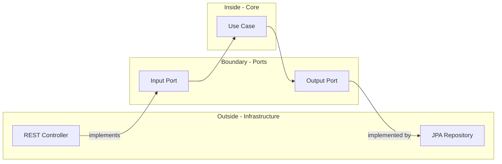
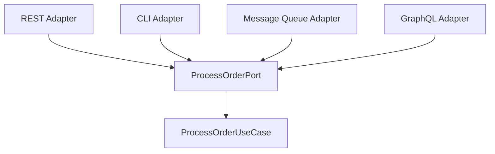
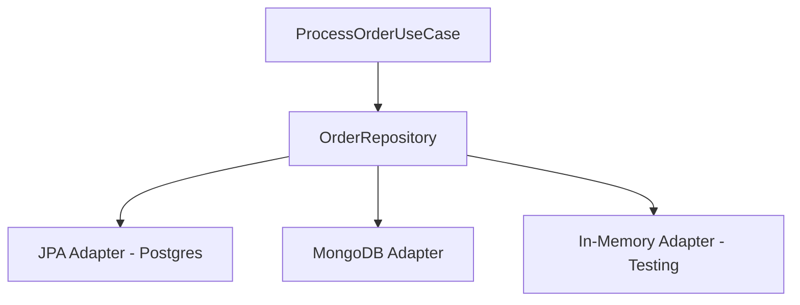

## What is Hexagonal Architecture?

Hexagonal Architecture (also known as **Ports and Adapters**) is an architectural pattern that creates a clear separation between:

- **Business logic** (the "inside" - domain and application layers)
- **Infrastructure concerns** (the "outside" - REST APIs, databases, external services)

<Tip>
The key insight: Your business logic should not know or care whether data comes from REST, GraphQL, message queues, or whether it's stored in PostgreSQL, MongoDB, or in-memory.
</Tip>

## The Hexagon Metaphor

```
                    ┌─────────────┐
              ┌────→│  REST API   │←────┐
              │     └─────────────┘     │
              │                         │
      ┌───────┴────┐             ┌─────┴───────┐
      │   Web UI   │             │  CLI Client │
      └────────────┘             └─────────────┘
              │                         │
              │    Driving Ports        │
              └──────────┬──────────────┘
                         │
                ┌────────▼─────────┐
                │                  │
                │   APPLICATION    │
                │   CORE LOGIC     │
                │   (USE CASES)    │
                │                  │
                └────────┬─────────┘
                         │
              ┌──────────┴──────────────┐
              │    Driven Ports         │
              │                         │
      ┌───────┴────┐             ┌─────┴───────┐
      │  Database  │             │  Email SMTP │
      │  Adapter   │             │   Adapter   │
      └────────────┘             └─────────────┘
              │                         │
              ▼                         ▼
        ┌──────────┐             ┌──────────┐
        │   JPA    │             │   SMTP   │
        │ Postgres │             │  Server  │
        └──────────┘             └──────────┘
```

<Note>
The hexagon shape is symbolic - it represents that the core application can have multiple ports, not just input and output.
</Note>

## Ports vs Adapters

### Ports (Interfaces)

Ports are **interfaces** that define contracts. They live in the application layer.

<CardGroup cols={2}>
  <Card title="Input Ports (Driving)" icon="arrow-right">
    Define **what the application can do**
    
    Examples:
    - `ProcessOrderPort`
    - `GetOrderStatusPort`
    
    Called BY external actors (REST controllers, CLI)
  </Card>
  
  <Card title="Output Ports (Driven)" icon="arrow-left">
    Define **what the application needs**
    
    Examples:
    - `OrderRepository`
    - `TaskRepository`
    
    Implemented BY infrastructure adapters
  </Card>
</CardGroup>

### Adapters (Implementations)

Adapters are **concrete implementations** that connect ports to external systems.



## Input Ports (Driving Ports)

These define the **use cases** our application exposes.

### Example: ProcessOrderPort

<Steps>
  <Step title="Define the Port (Interface)">
    ```java src/main/java/com/foodtech/kitchen/application/ports/in/ProcessOrderPort.java
    package com.foodtech.kitchen.application.ports.in;

    import com.foodtech.kitchen.domain.model.Order;
    import com.foodtech.kitchen.domain.model.Task;
    import java.util.List;

    public interface ProcessOrderPort {
        List<Task> execute(Order order);
    }
    ```
    
    <Note>
    This interface uses **domain objects** (`Order`, `Task`), not DTOs or infrastructure types.
    </Note>
  </Step>
  
  <Step title="Implement in Use Case">
    ```java src/main/java/com/foodtech/kitchen/application/usecases/ProcessOrderUseCase.java
    @Service
    public class ProcessOrderUseCase implements ProcessOrderPort {
        private final OrderRepository orderRepository;
        private final TaskDecomposer taskDecomposer;
        private final TaskRepository taskRepository;

        public ProcessOrderUseCase(
                OrderRepository orderRepository,
                TaskDecomposer taskDecomposer,
                TaskRepository taskRepository
        ) {
            this.orderRepository = orderRepository;
            this.taskDecomposer = taskDecomposer;
            this.taskRepository = taskRepository;
        }

        @Override
        public List<Task> execute(Order order) {
            Order savedOrder = orderRepository.save(order);
            List<Task> tasks = taskDecomposer.decompose(savedOrder);
            taskRepository.saveAll(tasks);
            return tasks;
        }
    }
    ```
  </Step>
  
  <Step title="Connect Adapter (REST Controller)">
    ```java src/main/java/com/foodtech/kitchen/infrastructure/rest/OrderController.java
    @RestController
    @RequestMapping("/api/orders")
    public class OrderController {
        private final ProcessOrderPort processOrderPort;

        public OrderController(ProcessOrderPort processOrderPort) {
            this.processOrderPort = processOrderPort;
        }

        @PostMapping
        public ResponseEntity<CreateOrderResponse> createOrder(
                @RequestBody CreateOrderRequest request) {
            // 1. Convert DTO to Domain
            Order order = OrderMapper.toDomain(request);
            
            // 2. Call the port (use case)
            List<Task> tasks = processOrderPort.execute(order);
            
            // 3. Convert Domain to DTO
            CreateOrderResponse response = new CreateOrderResponse(
                order.getTableNumber(),
                tasks.size(),
                "Order processed successfully"
            );
            
            return ResponseEntity.status(HttpStatus.CREATED).body(response);
        }
    }
    ```
    
    <Tip>
    Notice the controller's responsibility: convert between REST world (DTOs, HTTP) and domain world (entities, business logic).
    </Tip>
  </Step>
</Steps>

## Output Ports (Driven Ports)

These define **dependencies** the application needs from infrastructure.

### Example: OrderRepository Port

<Steps>
  <Step title="Define the Port">
    ```java src/main/java/com/foodtech/kitchen/application/ports/out/OrderRepository.java
    package com.foodtech.kitchen.application.ports.out;

    import com.foodtech.kitchen.domain.model.Order;

    public interface OrderRepository {
        Order save(Order order);
    }
    ```
    
    <Note>
    **Important**: This interface is in the **application layer**, not infrastructure. The application defines what it needs.
    </Note>
  </Step>
  
  <Step title="Implement the Adapter">
    ```java src/main/java/com/foodtech/kitchen/infrastructure/persistence/adapters/OrderRepositoryAdapter.java
    @Component
    public class OrderRepositoryAdapter implements OrderRepository {
        private final OrderJpaRepository jpaRepository;
        private final OrderEntityMapper mapper;

        public OrderRepositoryAdapter(
                OrderJpaRepository jpaRepository,
                OrderEntityMapper mapper) {
            this.jpaRepository = jpaRepository;
            this.mapper = mapper;
        }

        @Override
        public Order save(Order order) {
            // Convert domain to JPA entity
            OrderEntity entity = mapper.toEntity(order);
            
            // Save using JPA
            OrderEntity savedEntity = jpaRepository.save(entity);
            
            // Convert back to domain
            return mapper.toDomain(savedEntity);
        }
    }
    ```
    
    <Accordion title="Why use a mapper?">
    The mapper separates concerns:
    - **Domain objects** (`Order`) - rich behavior, business rules
    - **JPA entities** (`OrderEntity`) - persistence metadata, database mapping
    
    This allows domain objects to be technology-agnostic.
    </Accordion>
  </Step>
  
  <Step title="Wire with Dependency Injection">
    ```java src/main/java/com/foodtech/kitchen/infrastructure/config/ApplicationConfig.java
    @Configuration
    public class ApplicationConfig {
        @Bean
        public ProcessOrderUseCase processOrderUseCase(
                OrderRepository orderRepository,
                TaskDecomposer taskDecomposer,
                TaskRepository taskRepository) {
            return new ProcessOrderUseCase(
                orderRepository,
                taskDecomposer,
                taskRepository
            );
        }
    }
    ```
    
    Spring automatically injects `OrderRepositoryAdapter` when `OrderRepository` is requested (via `@Component` + interface implementation).
  </Step>
</Steps>

## Dependency Inversion in Action

The key principle: **High-level modules should not depend on low-level modules. Both should depend on abstractions.**

### Without Hexagonal Architecture ❌

```java
// Use case DIRECTLY depends on infrastructure
public class ProcessOrderUseCase {
    private final OrderJpaRepository jpaRepo; // ❌ Concrete JPA dependency
    
    public List<Task> execute(Order order) {
        OrderEntity entity = new OrderEntity(...); // ❌ Knows JPA
        jpaRepo.save(entity); // ❌ Coupled to persistence tech
    }
}
```

**Problems:**
- Cannot test without database
- Cannot switch from JPA to another technology
- Business logic mixed with persistence code

### With Hexagonal Architecture ✅

```java
// Use case depends on abstraction
public class ProcessOrderUseCase {
    private final OrderRepository repository; // ✅ Abstract interface
    
    public List<Task> execute(Order order) {
        Order saved = repository.save(order); // ✅ Clean, tech-agnostic
    }
}
```

**Benefits:**
- Easy to test with mock implementation
- Can swap JPA for MongoDB without changing use case
- Business logic stays pure

## Multiple Adapters per Port

One of hexagonal architecture's strengths: **multiple adapters can implement the same port**.

### Example: Multiple Input Adapters



All adapters translate their specific protocol into domain calls:

```java
// REST Adapter
@RestController
public class OrderController {
    private final ProcessOrderPort port;
    
    @PostMapping("/api/orders")
    public ResponseEntity<?> create(@RequestBody CreateOrderRequest req) {
        Order order = OrderMapper.toDomain(req);
        return port.execute(order);
    }
}

// CLI Adapter
public class OrderCLI {
    private final ProcessOrderPort port;
    
    public void handleCommand(String[] args) {
        Order order = parseCliArgs(args);
        port.execute(order);
    }
}

// Message Queue Adapter
@Component
public class OrderMessageListener {
    private final ProcessOrderPort port;
    
    @RabbitListener(queues = "orders")
    public void receiveMessage(OrderMessage msg) {
        Order order = MessageMapper.toDomain(msg);
        port.execute(order);
    }
}
```

<Tip>
**The use case doesn't change** - it remains the same regardless of how it's invoked!
</Tip>

### Example: Multiple Output Adapters



```java
// Production: JPA Adapter
@Component
@Profile("prod")
public class OrderJpaRepositoryAdapter implements OrderRepository {
    private final OrderJpaRepository jpaRepo;
    
    public Order save(Order order) {
        OrderEntity entity = mapper.toEntity(order);
        return mapper.toDomain(jpaRepo.save(entity));
    }
}

// Testing: In-Memory Adapter
@Component
@Profile("test")
public class OrderInMemoryRepository implements OrderRepository {
    private final Map<Long, Order> storage = new HashMap<>();
    private Long idCounter = 1L;
    
    public Order save(Order order) {
        Order saved = new Order(idCounter++, order.getTableNumber(), 
                                order.getProducts());
        storage.put(saved.getId(), saved);
        return saved;
    }
}
```

## Testing Strategy

Hexagonal architecture makes testing straightforward at every level.

<Steps>
  <Step title="Unit Test Domain Logic">
    Test pure business logic without any infrastructure:
    
    ```java
    class TaskDecomposerTest {
        @Test
        void shouldGroupProductsByStation() {
            // Arrange
            Order order = new Order("A1", List.of(
                new Product("Coca Cola", ProductType.DRINK),
                new Product("Pizza", ProductType.HOT_DISH),
                new Product("Salad", ProductType.COLD_DISH)
            ));
            order.setId(1L);
            
            TaskDecomposer decomposer = new TaskDecomposer(
                new OrderValidator(),
                new TaskFactory()
            );
            
            // Act
            List<Task> tasks = decomposer.decompose(order);
            
            // Assert
            assertEquals(3, tasks.size());
            assertTrue(tasks.stream().anyMatch(t -> t.getStation() == Station.BAR));
            assertTrue(tasks.stream().anyMatch(t -> t.getStation() == Station.HOT_KITCHEN));
            assertTrue(tasks.stream().anyMatch(t -> t.getStation() == Station.COLD_KITCHEN));
        }
    }
    ```
    
    **No mocks needed** - pure domain logic!
  </Step>
  
  <Step title="Unit Test Use Cases with Mocks">
    Test orchestration logic by mocking ports:
    
    ```java
    class ProcessOrderUseCaseTest {
        @Mock
        private OrderRepository orderRepository;
        
        @Mock
        private TaskRepository taskRepository;
        
        @InjectMocks
        private ProcessOrderUseCase useCase;
        
        @Test
        void shouldSaveOrderAndTasks() {
            // Arrange
            Order order = new Order("A1", List.of(...));
            Order savedOrder = new Order(1L, "A1", List.of(...));
            
            when(orderRepository.save(order)).thenReturn(savedOrder);
            
            // Act
            List<Task> result = useCase.execute(order);
            
            // Assert
            verify(orderRepository).save(order);
            verify(taskRepository).saveAll(any());
        }
    }
    ```
  </Step>
  
  <Step title="Integration Test Adapters">
    Test adapters with real infrastructure:
    
    ```java
    @DataJpaTest
    class OrderRepositoryAdapterTest {
        @Autowired
        private OrderJpaRepository jpaRepository;
        
        @Autowired
        private OrderEntityMapper mapper;
        
        private OrderRepositoryAdapter adapter;
        
        @BeforeEach
        void setup() {
            adapter = new OrderRepositoryAdapter(jpaRepository, mapper);
        }
        
        @Test
        void shouldSaveAndRetrieveOrder() {
            // Arrange
            Order order = new Order("A1", List.of(...));
            
            // Act
            Order saved = adapter.save(order);
            
            // Assert
            assertNotNull(saved.getId());
            assertEquals("A1", saved.getTableNumber());
        }
    }
    ```
  </Step>
  
  <Step title="End-to-End Test via REST">
    Test complete flow through HTTP:
    
    ```java
    @SpringBootTest(webEnvironment = RANDOM_PORT)
    class OrderControllerIntegrationTest {
        @Autowired
        private TestRestTemplate restTemplate;
        
        @Test
        void shouldProcessOrderViaRest() {
            // Arrange
            CreateOrderRequest request = new CreateOrderRequest(
                "A1",
                List.of(
                    new ProductRequest("Coca Cola", "DRINK"),
                    new ProductRequest("Pizza", "HOT_DISH")
                )
            );
            
            // Act
            ResponseEntity<CreateOrderResponse> response = 
                restTemplate.postForEntity("/api/orders", request, 
                                         CreateOrderResponse.class);
            
            // Assert
            assertEquals(HttpStatus.CREATED, response.getStatusCode());
            assertEquals(2, response.getBody().tasksCreated());
        }
    }
    ```
  </Step>
</Steps>

## Benefits Recap

<CardGroup cols={2}>
  <Card title="Technology Independence" icon="plug">
    Swap frameworks, databases, protocols without touching business logic
  </Card>
  
  <Card title="Testability" icon="vial">
    Test business logic in isolation, test adapters with real tech
  </Card>
  
  <Card title="Flexibility" icon="wrench">
    Multiple adapters per port - REST + GraphQL + CLI simultaneously
  </Card>
  
  <Card title="Maintainability" icon="screwdriver-wrench">
    Clear boundaries make changes localized and predictable
  </Card>
</CardGroup>

## Common Pitfalls

<Accordion title="❌ Leaking infrastructure types into domain">
  ```java
  // BAD - JPA annotations in domain
  @Entity
  public class Order {
      @Id
      private Long id;
  }
  
  // GOOD - Pure POJO
  public class Order {
      private final Long id;
  }
  ```
</Accordion>

<Accordion title="❌ Domain depending on frameworks">
  ```java
  // BAD - Domain depends on Spring
  public class Order {
      @Autowired
      private OrderValidator validator;
  }
  
  // GOOD - Constructor injection, no framework
  public class TaskDecomposer {
      private final OrderValidator validator;
      
      public TaskDecomposer(OrderValidator validator) {
          this.validator = validator;
      }
  }
  ```
</Accordion>

<Accordion title="❌ Use case knowing about HTTP/DTOs">
  ```java
  // BAD - Use case handles HTTP concepts
  public class ProcessOrderUseCase {
      public ResponseEntity<OrderDTO> execute(OrderDTO dto) {...}
  }
  
  // GOOD - Use case works with domain objects
  public class ProcessOrderUseCase {
      public List<Task> execute(Order order) {...}
  }
  ```
</Accordion>

## Next Steps

<CardGroup cols={2}>
  <Card title="Command Pattern" icon="terminal" href="/architecture/command-pattern">
    See how commands implement domain logic
  </Card>
  
  <Card title="Layer Interactions" icon="layer-group" href="/architecture/layers">
    Deep dive into how layers communicate
  </Card>
</CardGroup>