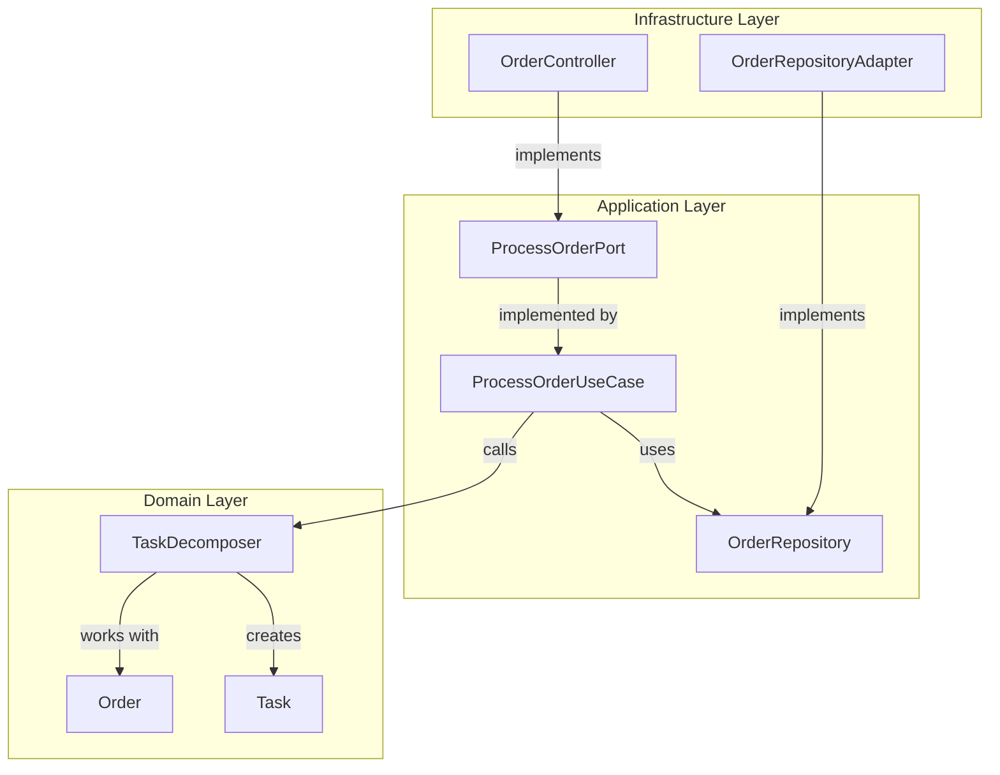
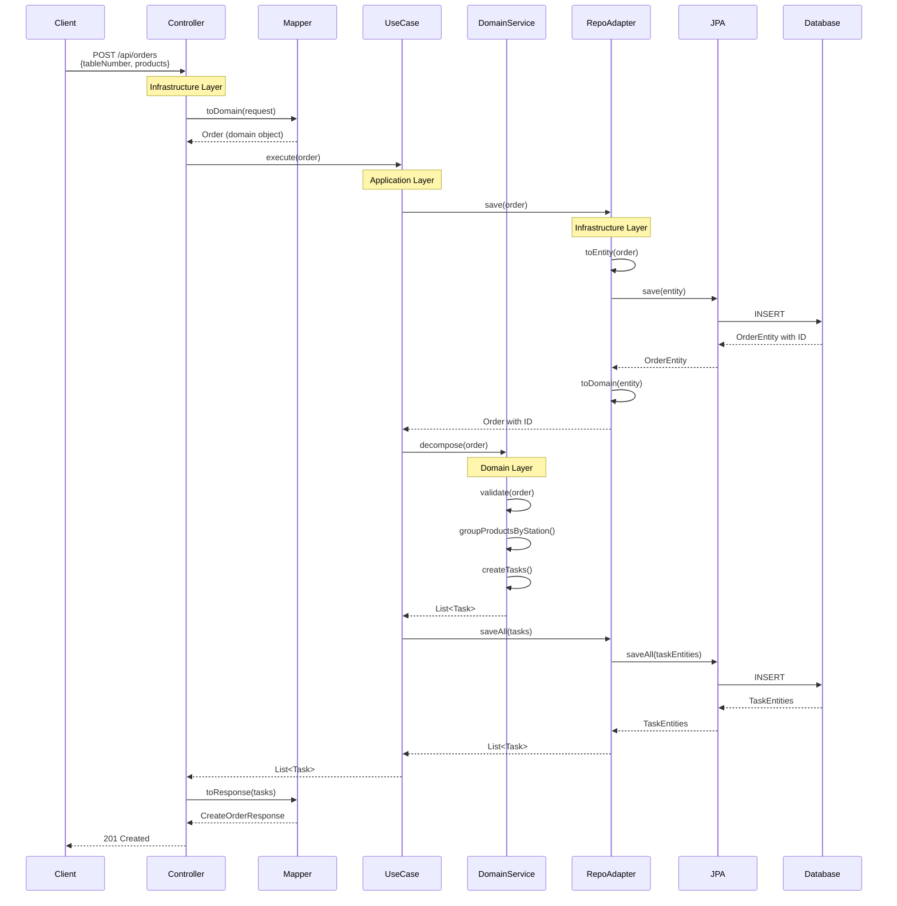

## Layer Overview

FoodTech Kitchen Service is organized into three distinct layers, each with specific responsibilities and dependencies.

```
┌─────────────────────────────────────────┐
│      INFRASTRUCTURE LAYER               │  External Technology
│  REST, JPA, Config, Spring Framework    │  (Depends on Application)
└─────────────────┬───────────────────────┘
                  │
                  ↓ depends on
┌─────────────────────────────────────────┐
│      APPLICATION LAYER                  │  Use Cases & Orchestration
│  Use Cases, Ports, Exceptions           │  (Depends on Domain)
└─────────────────┬───────────────────────┘
                  │
                  ↓ depends on
┌─────────────────────────────────────────┐
│      DOMAIN LAYER                       │  Pure Business Logic
│  Entities, Commands, Services, Enums    │  (Zero Dependencies)
└─────────────────────────────────────────┘
```

<Note>
**Critical Rule**: Dependencies flow **inward only**. Inner layers never import from outer layers.
</Note>

## Domain Layer (Core)

The innermost layer contains **pure business logic** with absolutely no external dependencies.

### Components

<CardGroup cols={2}>
  <Card title="Entities" icon="cube">
    Core business objects with behavior:
    - `Order`
    - `Task`
    - `Product`
  </Card>
  
  <Card title="Value Objects" icon="tag">
    Immutable types:
    - `Station` enum
    - `ProductType` enum
    - `TaskStatus` enum
  </Card>
  
  <Card title="Commands" icon="terminal">
    Encapsulated operations:
    - `PrepareDrinkCommand`
    - `PrepareHotDishCommand`
    - `PrepareColdDishCommand`
  </Card>
  
  <Card title="Domain Services" icon="gears">
    Complex business logic:
    - `TaskDecomposer`
    - `TaskFactory`
    - `CommandFactory`
    - `OrderValidator`
  </Card>
</CardGroup>

### Example: Product Type with Station Mapping

```java src/main/java/com/foodtech/kitchen/domain/model/ProductType.java
package com.foodtech.kitchen.domain.model;

public enum ProductType {
    DRINK(Station.BAR),
    HOT_DISH(Station.HOT_KITCHEN),
    COLD_DISH(Station.COLD_KITCHEN);

    private final Station station;

    ProductType(Station station) {
        this.station = station;
    }

    public Station getStation() {
        return station;
    }
}
```

<Accordion title="Design Decision: Why ProductType knows its Station?">
  **Benefits of this approach:**
  
  ✅ **Open/Closed Principle**: Adding new product types doesn't require modifying mapping logic elsewhere
  
  ✅ **Single Source of Truth**: The relationship between product type and station is defined in one place
  
  ✅ **Type Safety**: Enum ensures only valid stations
  
  **Alternative (rejected):**
  ```java
  // ❌ Violates OCP - requires modification when adding types
  public Station mapProductToStation(ProductType type) {
      return switch(type) {
          case DRINK -> Station.BAR;
          case HOT_DISH -> Station.HOT_KITCHEN;
          case COLD_DISH -> Station.COLD_KITCHEN;
          // Must add new cases here
      };
  }
  ```
</Accordion>

### Example: Task Entity with Lifecycle

```java src/main/java/com/foodtech/kitchen/domain/model/Task.java
public class Task {
    private final Long id;
    private final Long orderId;
    private final Station station;
    private final String tableNumber;
    private final List<Product> products;
    private final LocalDateTime createdAt;
    private TaskStatus status;
    private LocalDateTime startedAt;
    private LocalDateTime completedAt;

    // Constructor for NEW tasks (no ID yet)
    public Task(Long orderId, Station station, String tableNumber,
                List<Product> products, LocalDateTime createdAt) {
        validate(orderId, station, tableNumber, products, createdAt);
        this.id = null;
        this.orderId = orderId;
        this.station = station;
        this.tableNumber = tableNumber;
        this.products = new ArrayList<>(products); // Defensive copy
        this.createdAt = createdAt;
        this.status = TaskStatus.PENDING;
    }

    // Lifecycle methods
    public void start() {
        if (this.status != TaskStatus.PENDING) {
            throw new IllegalStateException(
                "Task must be in PENDING status to start"
            );
        }
        this.status = TaskStatus.IN_PREPARATION;
        this.startedAt = LocalDateTime.now();
    }

    public void complete() {
        if (this.status != TaskStatus.IN_PREPARATION) {
            throw new IllegalStateException(
                "Task must be in IN_PREPARATION status to complete"
            );
        }
        this.status = TaskStatus.COMPLETED;
        this.completedAt = LocalDateTime.now();
    }
}
```

<Tip>
**Rich Domain Model**: The `Task` entity enforces its own business rules. You cannot complete a task that hasn't been started.
</Tip>

### Example: TaskDecomposer Service

```java src/main/java/com/foodtech/kitchen/domain/services/TaskDecomposer.java
package com.foodtech.kitchen.domain.services;

import com.foodtech.kitchen.domain.model.*;
import java.util.*;

public class TaskDecomposer {
    private final OrderValidator orderValidator;
    private final TaskFactory taskFactory;

    public TaskDecomposer(OrderValidator orderValidator, 
                         TaskFactory taskFactory) {
        this.orderValidator = orderValidator;
        this.taskFactory = taskFactory;
    }

    public List<Task> decompose(Order order) {
        // 1. Validate business rules
        orderValidator.validate(order);

        // 2. Group products by station
        Map<Station, List<Product>> productsByStation = 
            groupProductsByStation(order);

        // 3. Create one task per station
        Long orderId = order.getId() != null ? order.getId() : 0L;
        return taskFactory.createTasks(
            orderId, 
            order.getTableNumber(), 
            productsByStation
        );
    }

    private Map<Station, List<Product>> groupProductsByStation(Order order) {
        Map<Station, List<Product>> productsByStation = new HashMap<>();

        for (Product product : order.getProducts()) {
            Station station = product.getType().getStation();
            productsByStation
                .computeIfAbsent(station, k -> new ArrayList<>())
                .add(product);
        }

        return productsByStation;
    }
}
```

<Note>
Notice: **Zero framework dependencies**. This is pure Java with domain logic only.
</Note>

## Application Layer (Orchestration)

The middle layer **orchestrates** domain services to fulfill use cases.

### Components

<Steps>
  <Step title="Input Ports (Interfaces)">
    Define what the application **can do**:
    
    ```java src/main/java/com/foodtech/kitchen/application/ports/in/ProcessOrderPort.java
    package com.foodtech.kitchen.application.ports.in;

    import com.foodtech.kitchen.domain.model.Order;
    import com.foodtech.kitchen.domain.model.Task;
    import java.util.List;

    public interface ProcessOrderPort {
        List<Task> execute(Order order);
    }
    ```
  </Step>
  
  <Step title="Output Ports (Interfaces)">
    Define what the application **needs**:
    
    ```java src/main/java/com/foodtech/kitchen/application/ports/out/OrderRepository.java
    package com.foodtech.kitchen.application.ports.out;

    import com.foodtech.kitchen.domain.model.Order;

    public interface OrderRepository {
        Order save(Order order);
    }
    ```
    
    <Tip>
    Output ports are defined by the **application layer**, not infrastructure. This inverts the dependency.
    </Tip>
  </Step>
  
  <Step title="Use Cases (Implementations)">
    Orchestrate domain services:
    
    ```java src/main/java/com/foodtech/kitchen/application/usecases/ProcessOrderUseCase.java
    @Service
    public class ProcessOrderUseCase implements ProcessOrderPort {
        private final OrderRepository orderRepository;
        private final TaskDecomposer taskDecomposer;
        private final TaskRepository taskRepository;

        public ProcessOrderUseCase(
                OrderRepository orderRepository,
                TaskDecomposer taskDecomposer,
                TaskRepository taskRepository
        ) {
            this.orderRepository = orderRepository;
            this.taskDecomposer = taskDecomposer;
            this.taskRepository = taskRepository;
        }

        @Override
        public List<Task> execute(Order order) {
            // 1. Persist order (get ID)
            Order savedOrder = orderRepository.save(order);
            
            // 2. Decompose into tasks
            List<Task> tasks = taskDecomposer.decompose(savedOrder);
            
            // 3. Persist tasks
            taskRepository.saveAll(tasks);
            
            return tasks;
        }
    }
    ```
  </Step>
</Steps>

### Dependency Flow



<Note>
The use case depends on **abstractions** (`OrderRepository` interface), not concrete implementations.
</Note>

## Infrastructure Layer (Technical Implementation)

The outermost layer provides **concrete implementations** using specific technologies.

### REST Adapter (Driving)

<Accordion title="OrderController - HTTP to Domain">
  ```java src/main/java/com/foodtech/kitchen/infrastructure/rest/OrderController.java
  @RestController
  @RequestMapping("/api/orders")
  public class OrderController {
      private static final String ORDER_SUCCESS_MESSAGE = 
          "Order processed successfully";

      private final ProcessOrderPort processOrderPort;
      private final GetOrderStatusPort getOrderStatusPort;

      public OrderController(ProcessOrderPort processOrderPort,
                             GetOrderStatusPort getOrderStatusPort) {
          this.processOrderPort = processOrderPort;
          this.getOrderStatusPort = getOrderStatusPort;
      }

      @PostMapping
      public ResponseEntity<CreateOrderResponse> createOrder(
              @RequestBody CreateOrderRequest request) {
          // 1. Convert REST DTO to Domain object
          Order order = OrderMapper.toDomain(request);
          
          // 2. Call application layer (port)
          List<Task> tasks = processOrderPort.execute(order);
          
          // 3. Convert Domain to REST DTO
          CreateOrderResponse response = new CreateOrderResponse(
              order.getTableNumber(),
              tasks.size(),
              ORDER_SUCCESS_MESSAGE
          );

          return ResponseEntity.status(HttpStatus.CREATED).body(response);
      }

      @GetMapping("/{orderId}/status")
      public ResponseEntity<Map<String, String>> getOrderStatus(
              @PathVariable Long orderId) {
          TaskStatus status = getOrderStatusPort.execute(orderId);
          return ResponseEntity.ok(Map.of(
              "orderId", orderId.toString(),
              "status", status.name()
          ));
      }
  }
  ```
  
  **Responsibilities:**
  - Handle HTTP concerns (status codes, headers)
  - Map between DTOs and domain objects
  - Delegate business logic to use cases
</Accordion>

<Accordion title="OrderMapper - DTO Transformation">
  ```java
  public class OrderMapper {
      public static Order toDomain(CreateOrderRequest request) {
          List<Product> products = request.products().stream()
              .map(OrderMapper::mapProduct)
              .toList();
          return new Order(request.tableNumber(), products);
      }
      
      private static Product mapProduct(ProductRequest productRequest) {
          ProductType type = ProductType.valueOf(
              productRequest.type().toUpperCase()
          );
          return new Product(productRequest.name(), type);
      }
  }
  ```
  
  <Tip>
  Mappers keep the controller focused on HTTP concerns, separating transformation logic.
  </Tip>
</Accordion>

### Persistence Adapter (Driven)

<Accordion title="OrderRepositoryAdapter - Domain to JPA">
  ```java src/main/java/com/foodtech/kitchen/infrastructure/persistence/adapters/OrderRepositoryAdapter.java
  @Component
  public class OrderRepositoryAdapter implements OrderRepository {
      private final OrderJpaRepository jpaRepository;
      private final OrderEntityMapper mapper;

      public OrderRepositoryAdapter(
              OrderJpaRepository jpaRepository,
              OrderEntityMapper mapper) {
          this.jpaRepository = jpaRepository;
          this.mapper = mapper;
      }

      @Override
      public Order save(Order order) {
          // 1. Convert Domain → JPA Entity
          OrderEntity entity = mapper.toEntity(order);
          
          // 2. Persist using JPA
          OrderEntity savedEntity = jpaRepository.save(entity);
          
          // 3. Convert JPA Entity → Domain
          return mapper.toDomain(savedEntity);
      }
  }
  ```
  
  **Key Points:**
  - ✅ Implements the **output port** from application layer
  - ✅ Uses **JPA** for actual persistence
  - ✅ Translates between domain objects and JPA entities
  - ✅ Hides JPA details from application/domain
</Accordion>

<Accordion title="OrderEntityMapper - Bidirectional Mapping">
  ```java
  @Component
  public class OrderEntityMapper {
      private final ObjectMapper objectMapper;

      public OrderEntityMapper(ObjectMapper objectMapper) {
          this.objectMapper = objectMapper;
      }

      public OrderEntity toEntity(Order order) {
          try {
              // Serialize products to JSON for storage
              String productsJson = objectMapper.writeValueAsString(
                  order.getProducts()
              );
              return new OrderEntity(
                  order.getId(),
                  order.getTableNumber(),
                  productsJson
              );
          } catch (JsonProcessingException e) {
              throw new RuntimeException("Error serializing products", e);
          }
      }

      public Order toDomain(OrderEntity entity) {
          try {
              // Deserialize products from JSON
              List<Product> products = objectMapper.readValue(
                  entity.getProductsJson(),
                  new TypeReference<List<Product>>() {}
              );
              return Order.reconstruct(
                  entity.getId(),
                  entity.getTableNumber(),
                  products
              );
          } catch (JsonProcessingException e) {
              throw new RuntimeException("Error deserializing products", e);
          }
      }
  }
  ```
  
  <Note>
  **Separation of Concerns**: The adapter handles persistence, the mapper handles transformation. Each has a single responsibility.
  </Note>
</Accordion>

## Complete Request Flow

Let's trace a **complete order** through all three layers:



<Steps>
  <Step title="Infrastructure → Application">
    **Controller** receives HTTP request, maps DTO to domain object, calls **use case port**
  </Step>
  
  <Step title="Application → Infrastructure">
    **Use case** calls **repository port** (interface), **adapter** (implementation) persists data
  </Step>
  
  <Step title="Application → Domain">
    **Use case** calls **domain service** to execute business logic
  </Step>
  
  <Step title="Domain Processing">
    **Domain service** validates, transforms, and creates domain objects
  </Step>
  
  <Step title="Response Flow">
    Results bubble back up: Domain → Application → Infrastructure → Client
  </Step>
</Steps>

## Layer Communication Rules

<CardGroup cols={2}>
  <Card title="✅ Allowed" icon="check">
    - Infrastructure → Application (implements ports)
    - Application → Domain (calls services)
    - Domain → Domain (services use entities)
  </Card>
  
  <Card title="❌ Forbidden" icon="xmark">
    - Domain → Application
    - Domain → Infrastructure
    - Application → Infrastructure (only via ports)
  </Card>
</CardGroup>

### Example: Correct Dependency

```java
// ✅ Use case depends on abstract repository (Application → Application)
public class ProcessOrderUseCase {
    private final OrderRepository repository; // Interface from application layer
}

// ✅ Adapter implements the interface (Infrastructure → Application)
@Component
public class OrderRepositoryAdapter implements OrderRepository {
    // Implementation details
}
```

### Example: Incorrect Dependency ❌

```java
// ❌ Use case depends on concrete adapter (Application → Infrastructure)
public class ProcessOrderUseCase {
    private final OrderRepositoryAdapter adapter; // Concrete class!
}

// ❌ Domain depends on Spring Framework (Domain → Infrastructure)
public class TaskDecomposer {
    @Autowired // ❌ Spring annotation in domain!
    private OrderValidator validator;
}

// ❌ Domain depends on JPA (Domain → Infrastructure)
@Entity // ❌ JPA annotation in domain!
public class Order {
    @Id
    private Long id;
}
```

## Dependency Injection Configuration

Spring wires everything together:

```java src/main/java/com/foodtech/kitchen/infrastructure/config/ApplicationConfig.java
@Configuration
public class ApplicationConfig {
    
    // Domain services (no framework dependencies)
    @Bean
    public TaskDecomposer taskDecomposer(
            OrderValidator validator,
            TaskFactory taskFactory) {
        return new TaskDecomposer(validator, taskFactory);
    }
    
    @Bean
    public TaskFactory taskFactory() {
        return new TaskFactory();
    }
    
    @Bean
    public OrderValidator orderValidator() {
        return new OrderValidator();
    }
    
    @Bean
    public CommandFactory commandFactory() {
        return new CommandFactory();
    }
    
    @Bean
    public ObjectMapper objectMapper() {
        ObjectMapper mapper = new ObjectMapper();
        mapper.registerModule(new JavaTimeModule());
        return mapper;
    }
}
```

<Tip>
**Key Insight**: Domain objects are created as beans, but they don't have Spring annotations. The configuration is in the infrastructure layer.
</Tip>

## Testing Each Layer

<Accordion title="Domain Layer Tests (Pure Unit Tests)">
  ```java
  class TaskDecomposerTest {
      private TaskDecomposer decomposer;
      
      @BeforeEach
      void setup() {
          // Create domain objects manually - no Spring!
          decomposer = new TaskDecomposer(
              new OrderValidator(),
              new TaskFactory()
          );
      }
      
      @Test
      void shouldDecomposeOrderIntoTasks() {
          Order order = new Order(1L, "A1", List.of(
              new Product("Coca Cola", ProductType.DRINK),
              new Product("Pizza", ProductType.HOT_DISH)
          ));
          
          List<Task> tasks = decomposer.decompose(order);
          
          assertEquals(2, tasks.size());
      }
  }
  ```
  
  **Fast, isolated, no mocks needed!**
</Accordion>

<Accordion title="Application Layer Tests (With Mocks)">
  ```java
  @ExtendWith(MockitoExtension.class)
  class ProcessOrderUseCaseTest {
      @Mock
      private OrderRepository orderRepository;
      
      @Mock
      private TaskRepository taskRepository;
      
      @InjectMocks
      private ProcessOrderUseCase useCase;
      
      @Test
      void shouldSaveOrderAndTasks() {
          Order order = new Order("A1", List.of(...));
          Order savedOrder = Order.reconstruct(1L, "A1", List.of(...));
          
          when(orderRepository.save(order)).thenReturn(savedOrder);
          
          List<Task> result = useCase.execute(order);
          
          verify(orderRepository).save(order);
          verify(taskRepository).saveAll(any());
      }
  }
  ```
  
  **Mock output ports to test orchestration logic**
</Accordion>

<Accordion title="Infrastructure Layer Tests (Integration)">
  ```java
  @SpringBootTest(webEnvironment = RANDOM_PORT)
  class OrderControllerIntegrationTest {
      @Autowired
      private TestRestTemplate restTemplate;
      
      @Test
      void shouldProcessCompleteOrder() {
          CreateOrderRequest request = new CreateOrderRequest(
              "A1",
              List.of(
                  new ProductRequest("Coca Cola", "DRINK")
              )
          );
          
          ResponseEntity<CreateOrderResponse> response =
              restTemplate.postForEntity(
                  "/api/orders",
                  request,
                  CreateOrderResponse.class
              );
          
          assertEquals(HttpStatus.CREATED, response.getStatusCode());
          assertEquals(1, response.getBody().tasksCreated());
      }
  }
  ```
  
  **Test complete flow with real Spring context**
</Accordion>

## Benefits of Layered Architecture

<CardGroup cols={2}>
  <Card title="Testability" icon="vial">
    Each layer can be tested independently with appropriate strategies
  </Card>
  
  <Card title="Flexibility" icon="shuffle">
    Swap REST for GraphQL, or JPA for MongoDB, without touching business logic
  </Card>
  
  <Card title="Maintainability" icon="wrench">
    Clear boundaries make changes predictable and localized
  </Card>
  
  <Card title="Scalability" icon="up-right-and-down-left-from-center">
    Layers can evolve independently - add caching, async processing, etc.
  </Card>
</CardGroup>

## Common Anti-Patterns

<Accordion title="❌ Anemic Domain Model">
  ```java
  // BAD - Entity is just a data bag
  public class Task {
      private TaskStatus status;
      
      public TaskStatus getStatus() { return status; }
      public void setStatus(TaskStatus status) { this.status = status; }
  }
  
  // Service does all the work
  public class TaskService {
      public void startTask(Task task) {
          if (task.getStatus() != TaskStatus.PENDING) {
              throw new IllegalStateException("Cannot start");
          }
          task.setStatus(TaskStatus.IN_PREPARATION);
      }
  }
  
  // GOOD - Entity has behavior
  public class Task {
      private TaskStatus status;
      
      public void start() {
          if (this.status != TaskStatus.PENDING) {
              throw new IllegalStateException("Cannot start");
          }
          this.status = TaskStatus.IN_PREPARATION;
          this.startedAt = LocalDateTime.now();
      }
  }
  ```
</Accordion>

<Accordion title="❌ Layer Leakage">
  ```java
  // BAD - Controller logic in use case
  public class ProcessOrderUseCase {
      public ResponseEntity<OrderDTO> execute(OrderDTO dto) {
          // ❌ HTTP concern in application layer!
          return ResponseEntity.ok(dto);
      }
  }
  
  // BAD - JPA in domain
  @Entity // ❌ Infrastructure annotation!
  public class Order {
      // Domain polluted with JPA
  }
  
  // GOOD - Clean separation
  public class ProcessOrderUseCase {
      public List<Task> execute(Order order) {
          // Pure domain objects
      }
  }
  ```
</Accordion>

## Next Steps

<CardGroup cols={3}>
  <Card title="Architecture Overview" icon="diagram-project" href="/architecture/overview">
    Review high-level architecture concepts
  </Card>
  
  <Card title="Hexagonal Details" icon="hexagon" href="/architecture/hexagonal">
    Deep dive into ports and adapters
  </Card>
  
  <Card title="Testing Guide" icon="vial" href="/guides/testing">
    Learn how to test each layer
  </Card>
</CardGroup>