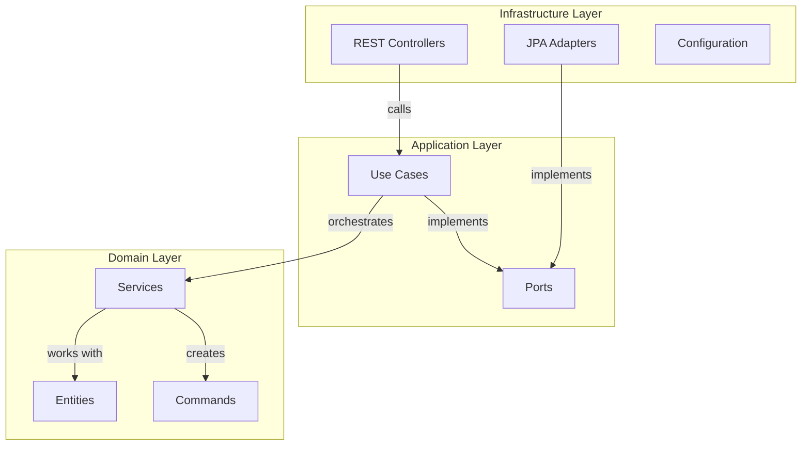
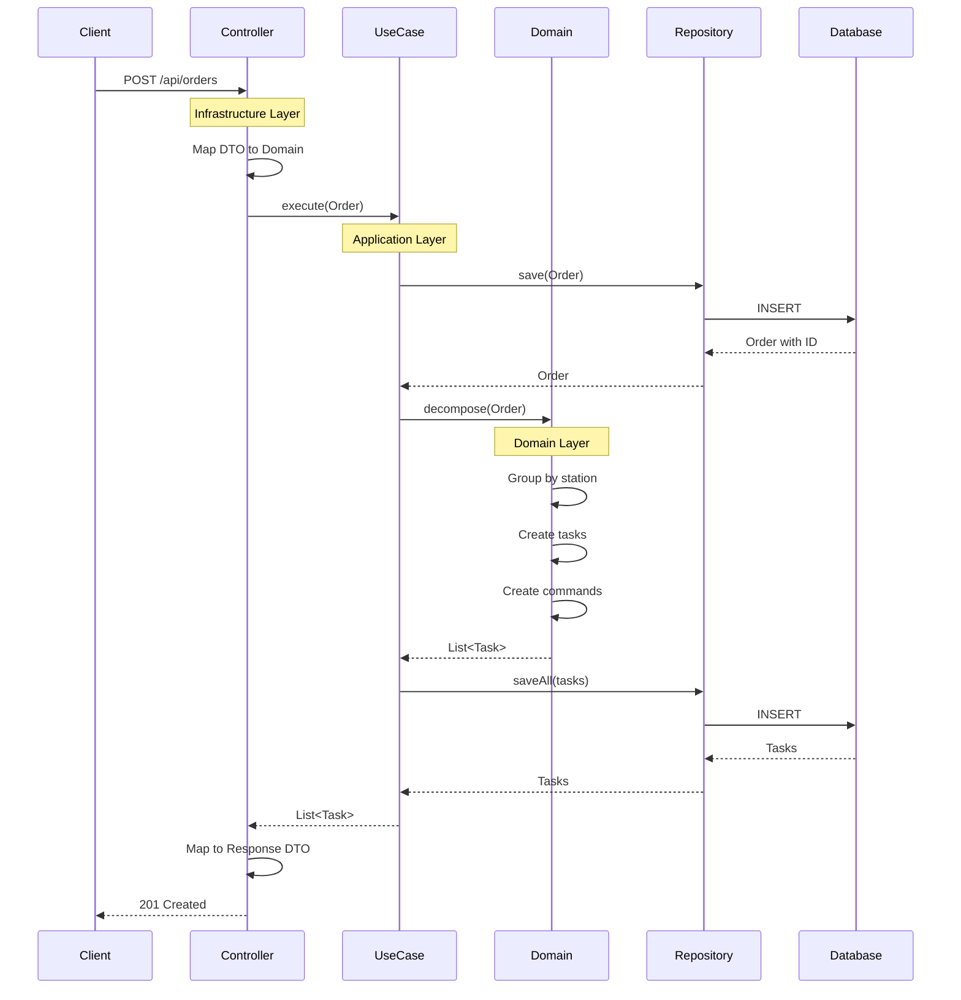

## Introduction

FoodTech Kitchen Service implements a **Hexagonal Architecture** (Ports & Adapters) following Clean Architecture principles. The system automates the decomposition of restaurant orders into station-specific tasks.

<Note>
This architecture ensures complete separation of business logic from infrastructure concerns, making the system highly testable and maintainable.
</Note>

## The Problem We Solve

When a restaurant order contains multiple products (drinks, hot dishes, salads), the system automatically:

1. Groups products by their kitchen station
2. Creates specific preparation tasks for each station
3. Executes preparation commands with station-appropriate workflows

<CardGroup cols={3}>
  <Card title="BAR Station" icon="martini-glass">
    Handles all beverages and cocktails
    - 3 seconds per drink
    - Parallel preparation possible
  </Card>
  
  <Card title="Hot Kitchen" icon="fire">
    Prepares hot dishes and soups
    - 7 seconds per dish
    - Sequential cooking required
  </Card>
  
  <Card title="Cold Kitchen" icon="salad">
    Assembles salads and desserts
    - 5 seconds per dish
    - Fresh ingredient handling
  </Card>
</CardGroup>

## Architectural Layers

The system is organized into three concentric layers, each with distinct responsibilities:



### Domain Layer (Core)

The innermost layer contains pure business logic with **zero external dependencies**.

<Accordion title="Domain Components">
  **Entities:**
  - `Order`: Represents a customer order with table number and products
  - `Task`: Represents a station-specific preparation task with lifecycle
  - `Product`: Individual items with type (DRINK, HOT_DISH, COLD_DISH)
  
  **Commands:**
  - `PrepareDrinkCommand`: Executes beverage preparation
  - `PrepareHotDishCommand`: Executes hot dish cooking
  - `PrepareColdDishCommand`: Executes cold dish assembly
  
  **Domain Services:**
  - `TaskDecomposer`: Breaks orders into station-specific tasks
  - `TaskFactory`: Creates task instances
  - `CommandFactory`: Creates appropriate commands per station
  - `OrderValidator`: Enforces business rules
</Accordion>

### Application Layer (Orchestration)

Orchestrates business logic through use cases without knowing infrastructure details.

<Steps>
  <Step title="Define Input Ports">
    Interfaces that represent what the application can do:
    ```java
    public interface ProcessOrderPort {
        List<Task> execute(Order order);
    }
    ```
  </Step>
  
  <Step title="Define Output Ports">
    Interfaces that represent what the application needs:
    ```java
    public interface OrderRepository {
        Order save(Order order);
    }
    ```
  </Step>
  
  <Step title="Implement Use Cases">
    Orchestrate domain services to fulfill business requirements:
    ```java src/main/java/com/foodtech/kitchen/application/usecases/ProcessOrderUseCase.java
    @Service
    public class ProcessOrderUseCase implements ProcessOrderPort {
        private final OrderRepository orderRepository;
        private final TaskDecomposer taskDecomposer;
        private final TaskRepository taskRepository;

        @Override
        public List<Task> execute(Order order) {
            Order savedOrder = orderRepository.save(order);
            List<Task> tasks = taskDecomposer.decompose(savedOrder);
            taskRepository.saveAll(tasks);
            return tasks;
        }
    }
    ```
  </Step>
</Steps>

### Infrastructure Layer (Technical Details)

Provides concrete implementations of ports using specific technologies.

<CardGroup cols={2}>
  <Card title="REST Adapter" icon="server">
    Exposes HTTP endpoints for external clients
    - Maps DTOs to domain objects
    - Handles HTTP concerns (status codes, validation)
  </Card>
  
  <Card title="Persistence Adapter" icon="database">
    Implements repository interfaces using JPA
    - Maps domain objects to JPA entities
    - Manages database transactions
  </Card>
</CardGroup>

## Dependency Rule

<Tip>
**Critical principle:** Dependencies always point inward. Outer layers depend on inner layers, never the reverse.
</Tip>

```
┌─────────────────────────────────────┐
│     Infrastructure Layer            │ ──┐
│  (REST, JPA, Config)               │   │
└─────────────────────────────────────┘   │
          ↓ depends on                    │
┌─────────────────────────────────────┐   │
│     Application Layer               │   │ All dependencies
│  (Use Cases, Ports)                │   │ point INWARD
└─────────────────────────────────────┘   │
          ↓ depends on                    │
┌─────────────────────────────────────┐   │
│     Domain Layer                    │ ←─┘
│  (Entities, Commands, Services)    │
│  NO EXTERNAL DEPENDENCIES          │
└─────────────────────────────────────┘
```

## Key Benefits

### Testability

<Steps>
  <Step title="Unit Test Domain Logic">
    Test business logic in isolation without any infrastructure:
    ```java
    @Test
    void shouldDecomposeOrderIntoTasks() {
        Order order = new Order("A1", List.of(
            new Product("Coca Cola", ProductType.DRINK),
            new Product("Pizza", ProductType.HOT_DISH)
        ));
        
        List<Task> tasks = taskDecomposer.decompose(order);
        
        assertEquals(2, tasks.size());
    }
    ```
  </Step>
  
  <Step title="Integration Test Adapters">
    Test infrastructure components with real implementations
  </Step>
  
  <Step title="End-to-End Test API">
    Test complete flows through REST endpoints
  </Step>
</Steps>

### Maintainability

- **Change database?** Only modify persistence adapters
- **Switch from REST to GraphQL?** Only modify API adapters
- **Add new station type?** Extend domain with new command, no infrastructure changes

### Technology Independence

The core business logic (Domain + Application layers) has **zero knowledge** of:
- Spring Framework
- JPA/Hibernate
- HTTP/REST
- Jackson (JSON)
- H2 Database

This makes the core logic:
- Portable across frameworks
- Testable without containers
- Evolvable without breaking changes

## Request Flow Example

Let's trace a complete order through all layers:



<Note>
Notice how each layer performs its specific responsibility without knowledge of adjacent layers' implementation details.
</Note>

## Project Structure

The physical file structure mirrors the logical architecture:

```
com.foodtech.kitchen/
├── domain/                    # Domain Layer - No dependencies
│   ├── model/
│   │   ├── Order.java
│   │   ├── Task.java
│   │   ├── Product.java
│   │   ├── Station.java
│   │   └── ProductType.java
│   ├── commands/
│   │   ├── Command.java
│   │   ├── PrepareDrinkCommand.java
│   │   ├── PrepareHotDishCommand.java
│   │   └── PrepareColdDishCommand.java
│   └── services/
│       ├── TaskDecomposer.java
│       ├── TaskFactory.java
│       └── CommandFactory.java
│
├── application/               # Application Layer - Depends on Domain
│   ├── usecases/
│   │   ├── ProcessOrderUseCase.java
│   │   └── GetTasksByStationUseCase.java
│   └── ports/
│       ├── in/                # Driving ports
│       │   └── ProcessOrderPort.java
│       └── out/               # Driven ports
│           ├── OrderRepository.java
│           └── TaskRepository.java
│
└── infrastructure/            # Infrastructure Layer - Depends on Application
    ├── rest/                  # REST Adapter (Driving)
    │   ├── OrderController.java
    │   └── dto/
    ├── persistence/           # JPA Adapter (Driven)
    │   ├── adapters/
    │   │   └── OrderRepositoryAdapter.java
    │   └── jpa/
    │       └── OrderJpaRepository.java
    └── config/
        └── ApplicationConfig.java
```

## Design Principles Applied

<CardGroup cols={2}>
  <Card title="Single Responsibility" icon="check">
    Each class has one reason to change
    - `OrderController`: Handle HTTP
    - `ProcessOrderUseCase`: Orchestrate flow
    - `OrderRepositoryAdapter`: Persist data
  </Card>
  
  <Card title="Open/Closed" icon="lock-open">
    Open for extension, closed for modification
    - Add new station: Create new command
    - No changes to existing code
  </Card>
  
  <Card title="Dependency Inversion" icon="arrows-up-down">
    Depend on abstractions, not concretions
    - Use cases depend on `OrderRepository` interface
    - Adapters implement the interface
  </Card>
  
  <Card title="Interface Segregation" icon="scissors">
    Small, focused interfaces
    - `ProcessOrderPort` has one method
    - Clients don't depend on unused methods
  </Card>
</CardGroup>

## Next Steps

<CardGroup cols={3}>
  <Card title="Hexagonal Details" icon="hexagon" href="/architecture/hexagonal">
    Deep dive into ports and adapters pattern
  </Card>
  
  <Card title="Command Pattern" icon="terminal" href="/architecture/command-pattern">
    Learn how commands encapsulate station logic
  </Card>
  
  <Card title="Layer Interactions" icon="layer-group" href="/architecture/layers">
    Understand how layers communicate
  </Card>
</CardGroup>