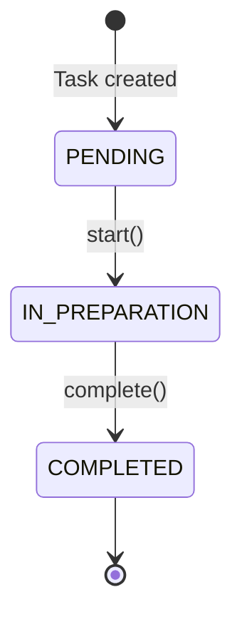

## Overview

This page documents the two key enumerations in the FoodTech Kitchen domain model: `Station` and `TaskStatus`. These enums define the fixed set of kitchen stations and the lifecycle states a task can be in.

<Note>
  Enums are used instead of strings to provide compile-time type safety and prevent invalid values from entering the system.
</Note>

## Station Enum

The `Station` enum represents the physical kitchen stations where food and beverages are prepared. Each station is responsible for specific types of products.

### Definition

```java
package com.foodtech.kitchen.domain.model;

public enum Station {
    BAR,
    HOT_KITCHEN,
    COLD_KITCHEN
}
```

### Station Types

<ParamField path="BAR" type="Station">
  The bar station handles all beverage preparation including alcoholic drinks, cocktails, soft drinks, and coffee.
</ParamField>

<ParamField path="HOT_KITCHEN" type="Station">
  The hot kitchen station prepares all cooked and heated dishes such as grilled meats, pasta, soups, and hot appetizers.
</ParamField>

<ParamField path="COLD_KITCHEN" type="Station">
  The cold kitchen station handles cold dishes including salads, cold appetizers, ceviche, sushi, and desserts.
</ParamField>

### Station Responsibilities

| Station | Product Types | Typical Products |
|---------|--------------|------------------|
| **BAR** | DRINK | Mojito, Beer, Wine, Coffee, Lemonade, Cocktails |
| **HOT_KITCHEN** | HOT_DISH | Grilled Steak, Pasta, Soup, Pizza, Stir-fry |
| **COLD_KITCHEN** | COLD_DISH | Caesar Salad, Ceviche, Sushi, Carpaccio, Cold Appetizers |

### Usage Examples

```java
// Using Station in task creation
Task task = new Task(
    orderId,
    Station.BAR,        // Assign to bar
    "T-15",
    drinkProducts,
    LocalDateTime.now()
);

// Checking station assignment
if (task.getStation() == Station.HOT_KITCHEN) {
    // Handle hot kitchen specific logic
}

// Getting station from product type
Product drink = new Product("Mojito", ProductType.DRINK);
Station station = drink.getType().getStation(); // Returns Station.BAR
```

### Station-ProductType Mapping

Each `ProductType` is automatically associated with its corresponding station:

```java
ProductType.DRINK.getStation()      // Returns Station.BAR
ProductType.HOT_DISH.getStation()   // Returns Station.HOT_KITCHEN
ProductType.COLD_DISH.getStation()  // Returns Station.COLD_KITCHEN
```

<Tip>
  The mapping between ProductType and Station is encapsulated within the ProductType enum, following the Open-Closed Principle.
</Tip>

## TaskStatus Enum

The `TaskStatus` enum represents the lifecycle states of a kitchen task. Tasks transition through these states as they are processed by kitchen staff.

### Definition

```java
package com.foodtech.kitchen.domain.model;

public enum TaskStatus {
    PENDING,
    IN_PREPARATION,
    COMPLETED
}
```

### Status Descriptions

<ParamField path="PENDING" type="TaskStatus">
  Initial state when a task is created. The task is waiting to be started by kitchen staff.
</ParamField>

<ParamField path="IN_PREPARATION" type="TaskStatus">
  The task has been started and is currently being prepared by kitchen staff.
</ParamField>

<ParamField path="COMPLETED" type="TaskStatus">
  The task has been finished. All products in the task are ready.
</ParamField>

### State Machine

Tasks follow a strict linear state machine:



### Valid State Transitions

| From | To | Method | Validation |
|------|-----|--------|------------|
| `PENDING` | `IN_PREPARATION` | `task.start()` | Must be in PENDING status |
| `IN_PREPARATION` | `COMPLETED` | `task.complete()` | Must be in IN_PREPARATION status |

<Warning>
  Invalid state transitions will throw `IllegalStateException`. You cannot skip states or transition backwards.
</Warning>

### Usage Examples

#### Basic Task Lifecycle

```java
// Create new task (status is PENDING)
Task task = new Task(orderId, Station.BAR, "T-15", products, LocalDateTime.now());
assert task.getStatus() == TaskStatus.PENDING;

// Start the task
task.start();
assert task.getStatus() == TaskStatus.IN_PREPARATION;
assert task.getStartedAt() != null;

// Complete the task
task.complete();
assert task.getStatus() == TaskStatus.COMPLETED;
assert task.getCompletedAt() != null;
```

#### Invalid State Transitions

```java
Task task = new Task(orderId, station, "T-15", products, LocalDateTime.now());

// Try to complete without starting
try {
    task.complete(); // Will throw IllegalStateException
} catch (IllegalStateException e) {
    // "Task must be in IN_PREPARATION status to complete"
}

// Try to start twice
task.start();
try {
    task.start(); // Will throw IllegalStateException
} catch (IllegalStateException e) {
    // "Task must be in PENDING status to start"
}
```

#### Checking Task Status

```java
// Query current status
switch (task.getStatus()) {
    case PENDING:
        System.out.println("Task is waiting to be started");
        break;
    case IN_PREPARATION:
        System.out.println("Task is being prepared");
        break;
    case COMPLETED:
        System.out.println("Task is finished");
        break;
}

// Filter tasks by status
List<Task> pendingTasks = allTasks.stream()
    .filter(t -> t.getStatus() == TaskStatus.PENDING)
    .collect(Collectors.toList());
```

#### Status with Timestamps

```java
Task task = new Task(orderId, station, "T-15", products, LocalDateTime.now());

// PENDING: only createdAt is set
assert task.getCreatedAt() != null;
assert task.getStartedAt() == null;
assert task.getCompletedAt() == null;

task.start();

// IN_PREPARATION: createdAt and startedAt are set
assert task.getCreatedAt() != null;
assert task.getStartedAt() != null;
assert task.getCompletedAt() == null;

task.complete();

// COMPLETED: all timestamps are set
assert task.getCreatedAt() != null;
assert task.getStartedAt() != null;
assert task.getCompletedAt() != null;

// Calculate preparation time
Duration prepTime = Duration.between(
    task.getStartedAt(), 
    task.getCompletedAt()
);
```

## Design Considerations

### Why Enums?

<Card title="Type Safety" icon="shield-check">
  Enums provide compile-time type safety. It's impossible to assign invalid station or status values.
</Card>

<Card title="Exhaustiveness Checking" icon="list-check">
  When using enums in switch statements, the compiler can warn you if you haven't handled all cases.
</Card>

<Card title="Self-Documenting" icon="book">
  Enum values clearly communicate the limited set of valid options without documentation.
</Card>

<Card title="Refactoring Safety" icon="wrench">
  Renaming or removing enum values will cause compilation errors, making refactoring safer.
</Card>

### Extensibility

<Note>
  Adding new stations or status values requires code changes. This is intentional—station and status values are core to the business logic and should be carefully controlled.
</Note>

To add a new station:

1. Add the new enum value to `Station`
2. Add a corresponding `ProductType` value
3. Update the `ProductType` to map to the new station
4. Update any UI or API documentation

```java
// Example: Adding a dessert station
public enum Station {
    BAR,
    HOT_KITCHEN,
    COLD_KITCHEN,
    DESSERT_STATION  // New station
}

public enum ProductType {
    DRINK(Station.BAR),
    HOT_DISH(Station.HOT_KITCHEN),
    COLD_DISH(Station.COLD_KITCHEN),
    DESSERT(Station.DESSERT_STATION);  // New product type
    
    // ... rest of implementation
}
```

## Integration Points

### REST API

Both enums are typically serialized as strings in JSON:

```json
{
  "station": "HOT_KITCHEN",
  "status": "IN_PREPARATION"
}
```

### Database Persistence

Enums are usually persisted as strings or ordinal values:

```java
@Entity
public class TaskEntity {
    @Enumerated(EnumType.STRING)
    private Station station;
    
    @Enumerated(EnumType.STRING)
    private TaskStatus status;
}
```

<Tip>
  Use `EnumType.STRING` rather than `EnumType.ORDINAL` for database persistence. This makes the database more readable and prevents issues when reordering enum values.
</Tip>

## Related Models

- [Task](/domain/task) - Uses both Station and TaskStatus
- [Product](/domain/product) - ProductType maps to Station
- [ProductType](/domain/product#producttype-enum) - Contains station mappings
