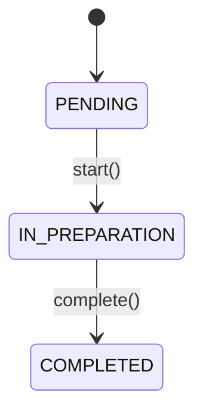

## Overview

The `Task` class represents a kitchen preparation task assigned to a specific station. When an Order is received, it's broken down into multiple Tasks—one for each station that needs to prepare products. Tasks track their lifecycle from creation through completion with status transitions and timestamps.

<Note>
  Tasks are the unit of work in the kitchen system. Each Task is assigned to exactly one Station and tracks its own preparation lifecycle.
</Note>

## Class Definition

```java
package com.foodtech.kitchen.domain.model;

import java.time.LocalDateTime;
import java.util.ArrayList;
import java.util.List;

public class Task {
    private final Long id;
    private final Long orderId;
    private final Station station;
    private final String tableNumber;
    private final List<Product> products;
    private final LocalDateTime createdAt;
    private TaskStatus status;
    private LocalDateTime startedAt;
    private LocalDateTime completedAt;
}
```

## Fields

### Immutable Fields

<ParamField path="id" type="Long">
  Unique identifier for the task. Set to `null` on creation and assigned by persistence.
</ParamField>

<ParamField path="orderId" type="Long" required>
  Reference to the parent Order that generated this task. Cannot be null.
</ParamField>

<ParamField path="station" type="Station" required>
  The kitchen station responsible for this task (BAR, HOT_KITCHEN, or COLD_KITCHEN).
</ParamField>

<ParamField path="tableNumber" type="String" required>
  The table number from the original order. Used for task identification.
</ParamField>

<ParamField path="products" type="List<Product>" required>
  Products assigned to this task (filtered by station). Must contain at least one product.
</ParamField>

<ParamField path="createdAt" type="LocalDateTime" required>
  Timestamp when the task was created. Cannot be null.
</ParamField>

### Mutable Fields

<ParamField path="status" type="TaskStatus">
  Current status of the task. Initialized to `PENDING` and transitions through `IN_PREPARATION` to `COMPLETED`.
</ParamField>

<ParamField path="startedAt" type="LocalDateTime">
  Timestamp when the task was started. Set when `start()` is called.
</ParamField>

<ParamField path="completedAt" type="LocalDateTime">
  Timestamp when the task was completed. Set when `complete()` is called.
</ParamField>

## Constructors

### Public Constructor

```java
public Task(Long orderId, Station station, String tableNumber,
            List<Product> products, LocalDateTime createdAt)
```

Creates a new Task in PENDING status.

**Parameters:**
- `orderId` - Parent order ID (required)
- `station` - Assigned station (required)
- `tableNumber` - Table number (required, cannot be empty)
- `products` - Products to prepare (required, cannot be empty)
- `createdAt` - Creation timestamp (required)

**Initial State:**
- `status` = `TaskStatus.PENDING`
- `startedAt` = `null`
- `completedAt` = `null`

### Reconstruction Factory Method

```java
public static Task reconstruct(Long id, Long orderId, Station station, 
                               String tableNumber, List<Product> products,
                               LocalDateTime createdAt, TaskStatus status,
                               LocalDateTime startedAt, LocalDateTime completedAt)
```

Reconstructs an existing Task from persistence with all state.

<Tip>
  Use this method when loading tasks from the database to restore their complete state including status and timestamps.
</Tip>

## Validation Rules

The Task class enforces strict validation rules:

| Field | Validation | Exception |
|-------|------------|----------|
| **Order ID** | Cannot be null | `IllegalArgumentException` |
| **Station** | Cannot be null | `IllegalArgumentException` |
| **Table Number** | Cannot be null or empty (after trim) | `IllegalArgumentException` |
| **Products** | Cannot be null or empty | `IllegalArgumentException` |
| **Created At** | Cannot be null | `IllegalArgumentException` |
| **ID (reconstruct)** | Cannot be null when reconstructing | `IllegalArgumentException` |

```java
private void validate(Long orderId, Station station, String tableNumber, 
                     List<Product> products, LocalDateTime createdAt) {
    if (orderId == null) {
        throw new IllegalArgumentException("Order ID cannot be null");
    }
    if (station == null) {
        throw new IllegalArgumentException("Station cannot be null");
    }
    if (tableNumber == null || tableNumber.trim().isEmpty()) {
        throw new IllegalArgumentException("Table number cannot be null or empty");
    }
    if (products == null || products.isEmpty()) {
        throw new IllegalArgumentException("Products list cannot be null or empty");
    }
    if (createdAt == null) {
        throw new IllegalArgumentException("Created at timestamp cannot be null");
    }
}
```

## State Transitions

Tasks follow a strict state machine with validation:



### start()

```java
public void start()
```

Transitions the task from PENDING to IN_PREPARATION.

**Preconditions:**
- Task status must be `PENDING`

**Effects:**
- Sets `status` to `TaskStatus.IN_PREPARATION`
- Sets `startedAt` to current timestamp

**Throws:**
- `IllegalStateException` if task is not in PENDING status

<Warning>
  You cannot start a task that is already in preparation or completed. Attempting to do so will throw an exception.
</Warning>

### complete()

```java
public void complete()
```

Transitions the task from IN_PREPARATION to COMPLETED.

**Preconditions:**
- Task status must be `IN_PREPARATION`

**Effects:**
- Sets `status` to `TaskStatus.COMPLETED`
- Sets `completedAt` to current timestamp

**Throws:**
- `IllegalStateException` if task is not in IN_PREPARATION status

<Warning>
  You cannot complete a task that hasn't been started. The task must be in IN_PREPARATION status.
</Warning>

## Public Methods

### Getters

```java
public Long getId()
public Long getOrderId()
public Station getStation()
public String getTableNumber()
public List<Product> getProducts() // Returns defensive copy
public LocalDateTime getCreatedAt()
public TaskStatus getStatus()
public LocalDateTime getStartedAt()
public LocalDateTime getCompletedAt()
```

<Note>
  `getProducts()` returns a defensive copy to prevent external modifications to the task's product list.
</Note>

## Usage Example

```java
// Creating a new task for the bar station
List<Product> drinks = List.of(
    new Product("Mojito", ProductType.DRINK),
    new Product("Lemonade", ProductType.DRINK)
);

Task task = new Task(
    456L,                    // orderId
    Station.BAR,             // station
    "T-15",                  // tableNumber
    drinks,                  // products
    LocalDateTime.now()      // createdAt
);

// Task lifecycle
task.getStatus(); // PENDING

task.start();
task.getStatus(); // IN_PREPARATION
task.getStartedAt(); // timestamp when started

// ... preparation happens ...

task.complete();
task.getStatus(); // COMPLETED
task.getCompletedAt(); // timestamp when completed

// Invalid state transition
try {
    task.start(); // Will throw IllegalStateException
} catch (IllegalStateException e) {
    // Task is already completed
}
```

## Business Logic

### Task Creation from Orders

Tasks are typically created by grouping Order products by their station:

```java
// Pseudo-code for task creation
Order order = // ... get order ...
Map<Station, List<Product>> productsByStation = 
    order.getProducts().stream()
        .collect(Collectors.groupingBy(p -> p.getType().getStation()));

List<Task> tasks = productsByStation.entrySet().stream()
    .map(entry -> new Task(
        order.getId(),
        entry.getKey(),
        order.getTableNumber(),
        entry.getValue(),
        LocalDateTime.now()
    ))
    .collect(Collectors.toList());
```

### Time Tracking

Tasks automatically track three important timestamps:

1. **createdAt** - When the task was created (set on construction)
2. **startedAt** - When kitchen staff began preparation (set on `start()`)
3. **completedAt** - When preparation finished (set on `complete()`)

<Tip>
  These timestamps can be used to calculate preparation time and identify bottlenecks in the kitchen workflow.
</Tip>

## Design Patterns

<Card title="State Machine Pattern" icon="diagram-project">
  Tasks enforce valid state transitions through methods that check preconditions and throw exceptions on invalid transitions.
</Card>

<Card title="Factory Method Pattern" icon="industry">
  The `reconstruct()` method provides a controlled way to rebuild tasks from persistence with all their state.
</Card>

<Card title="Defensive Copying" icon="shield">
  The products list is defensively copied in both constructor and getter to maintain immutability.
</Card>

## Related Models

- [Order](/domain/order) - Parent order that generated this task
- [Product](/domain/product) - Products to be prepared in this task
- [Station](/domain/stations) - Kitchen station assigned to this task
- [TaskStatus](/domain/task#taskstatus) - Status enum for task lifecycle
