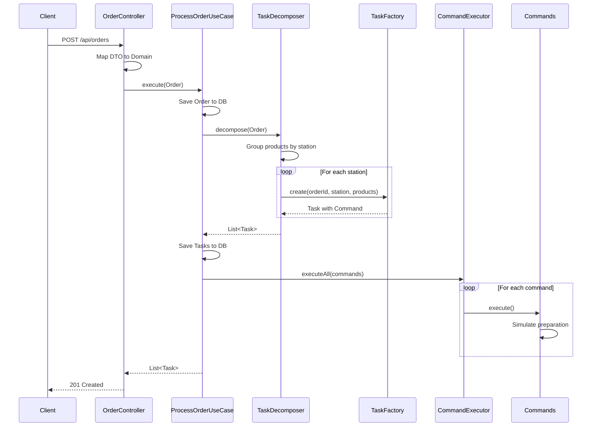

This quickstart guide will walk you through creating your first kitchen order using the FoodTech Kitchen Service REST API. You'll learn how to send an order that automatically gets decomposed into station-specific tasks.

## What You'll Build

You'll create a complete restaurant order that includes:
- Drinks that go to the BAR station
- Hot dishes that go to the HOT_KITCHEN station
- Cold dishes that go to the COLD_KITCHEN station

The system will automatically decompose your order into tasks and execute preparation commands for each kitchen station.

## Prerequisites

Before you begin, make sure you have:

<CardGroup cols={2}>
  <Card title="Service Running" icon="server">
    FoodTech Kitchen Service running on `http://localhost:8080`
  </Card>
  <Card title="HTTP Client" icon="terminal">
    curl, Postman, or any HTTP client installed
  </Card>
</CardGroup>

<Note>
If you haven't installed the service yet, check out the [Installation Guide](/installation) first.
</Note>

## Create Your First Order

<Steps>
  <Step title="Prepare the order request">
    The order consists of a table number and a list of products. Each product has a `name` and a `type`.

    Available product types:
    - `DRINK` - Beverages (routed to BAR)
    - `HOT_DISH` - Hot meals (routed to HOT_KITCHEN)
    - `COLD_DISH` - Salads and cold items (routed to COLD_KITCHEN)

    ```json
    {
      "tableNumber": "A1",
      "products": [
        {"name": "Coca Cola", "type": "DRINK"},
        {"name": "Sprite", "type": "DRINK"},
        {"name": "Pizza Margherita", "type": "HOT_DISH"},
        {"name": "Grilled Salmon", "type": "HOT_DISH"},
        {"name": "Caesar Salad", "type": "COLD_DISH"}
      ]
    }
    ```
  </Step>

  <Step title="Send the POST request">
    Use curl to send the order to the `/api/orders` endpoint:

    <CodeGroup>
      ```bash curl
      curl -X POST http://localhost:8080/api/orders \
        -H "Content-Type: application/json" \
        -d '{
          "tableNumber": "A1",
          "products": [
            {"name": "Coca Cola", "type": "DRINK"},
            {"name": "Sprite", "type": "DRINK"},
            {"name": "Pizza Margherita", "type": "HOT_DISH"},
            {"name": "Grilled Salmon", "type": "HOT_DISH"},
            {"name": "Caesar Salad", "type": "COLD_DISH"}
          ]
        }'
      ```

      ```javascript JavaScript (fetch)
      const response = await fetch('http://localhost:8080/api/orders', {
        method: 'POST',
        headers: {
          'Content-Type': 'application/json',
        },
        body: JSON.stringify({
          tableNumber: 'A1',
          products: [
            { name: 'Coca Cola', type: 'DRINK' },
            { name: 'Sprite', type: 'DRINK' },
            { name: 'Pizza Margherita', type: 'HOT_DISH' },
            { name: 'Grilled Salmon', type: 'HOT_DISH' },
            { name: 'Caesar Salad', type: 'COLD_DISH' }
          ]
        })
      });

      const data = await response.json();
      console.log(data);
      ```

      ```python Python (requests)
      import requests

      order = {
          "tableNumber": "A1",
          "products": [
              {"name": "Coca Cola", "type": "DRINK"},
              {"name": "Sprite", "type": "DRINK"},
              {"name": "Pizza Margherita", "type": "HOT_DISH"},
              {"name": "Grilled Salmon", "type": "HOT_DISH"},
              {"name": "Caesar Salad", "type": "COLD_DISH"}
          ]
      }

      response = requests.post(
          'http://localhost:8080/api/orders',
          json=order
      )

      print(response.json())
      ```
    </CodeGroup>
  </Step>

  <Step title="Verify the response">
    You should receive a `201 Created` response with the following structure:

    ```json
    {
      "tableNumber": "A1",
      "tasksCreated": 3,
      "message": "Order processed successfully"
    }
    ```

    <Note>
    The order was decomposed into **3 tasks** - one for each kitchen station:
    - **BAR**: 2 drinks (Coca Cola, Sprite) - 6 seconds total
    - **HOT_KITCHEN**: 2 hot dishes (Pizza, Salmon) - 14 seconds total
    - **COLD_KITCHEN**: 1 cold dish (Caesar Salad) - 5 seconds total
    </Note>
  </Step>

  <Step title="Check the server logs">
    In your server console, you'll see the Command Pattern in action as each station processes its tasks:

    ```plaintext
    [BAR] 🍹 Starting preparation of 2 drink(s)
    [BAR] Preparing drink 1/2: Coca Cola
    [BAR] ✓ Coca Cola ready!
    [BAR] Preparing drink 2/2: Sprite
    [BAR] ✓ Sprite ready!
    [BAR] ✅ All drinks completed in 6 seconds

    [HOT_KITCHEN] 🔥 Starting preparation of 2 hot dish(es)
    [HOT_KITCHEN] Cooking dish 1/2: Pizza Margherita
    [HOT_KITCHEN] ✓ Pizza Margherita ready!
    [HOT_KITCHEN] Cooking dish 2/2: Grilled Salmon
    [HOT_KITCHEN] ✓ Grilled Salmon ready!
    [HOT_KITCHEN] ✅ All hot dishes completed in 14 seconds

    [COLD_KITCHEN] 🥗 Starting preparation of 1 cold dish(es)
    [COLD_KITCHEN] Preparing dish 1/1: Caesar Salad
    [COLD_KITCHEN] ✓ Caesar Salad ready!
    [COLD_KITCHEN] ✅ All cold dishes completed in 5 seconds
    ```

    <Warning>
    The preparation is simulated with `Thread.sleep()`. Each product type has different preparation times:
    - **DRINK**: 3 seconds per item
    - **HOT_DISH**: 7 seconds per item
    - **COLD_DISH**: 5 seconds per item
    </Warning>
  </Step>
</Steps>

## Understanding the Flow

Here's what happens when you create an order:



## Key Architecture Patterns

<CardGroup cols={2}>
  <Card title="Hexagonal Architecture" icon="hexagon">
    Clean separation between domain, application, and infrastructure layers defined in `ProcessOrderUseCase.java:14`
  </Card>
  <Card title="Command Pattern" icon="bolt">
    Each station has a dedicated command class (`PrepareDrinkCommand.java:8`, `PrepareHotDishCommand.java`, `PrepareColdDishCommand.java`)
  </Card>
  <Card title="Repository Pattern" icon="database">
    Abstracted persistence through port interfaces in the application layer
  </Card>
  <Card title="Factory Pattern" icon="industry">
    `TaskFactory` and `CommandFactory` create appropriate objects based on station type
  </Card>
</CardGroup>

## Testing Different Scenarios

Try these variations to see how the system handles different order types:

<CodeGroup>
  ```bash Drinks Only
  curl -X POST http://localhost:8080/api/orders \
    -H "Content-Type: application/json" \
    -d '{
      "tableNumber": "B2",
      "products": [
        {"name": "Mojito", "type": "DRINK"},
        {"name": "Margarita", "type": "DRINK"},
        {"name": "Piña Colada", "type": "DRINK"}
      ]
    }'
  ```

  ```bash Hot Dishes Only
  curl -X POST http://localhost:8080/api/orders \
    -H "Content-Type: application/json" \
    -d '{
      "tableNumber": "C3",
      "products": [
        {"name": "Beef Steak", "type": "HOT_DISH"},
        {"name": "Chicken Curry", "type": "HOT_DISH"}
      ]
    }'
  ```

  ```bash Mixed Order
  curl -X POST http://localhost:8080/api/orders \
    -H "Content-Type: application/json" \
    -d '{
      "tableNumber": "D4",
      "products": [
        {"name": "Water", "type": "DRINK"},
        {"name": "Soup", "type": "HOT_DISH"},
        {"name": "Greek Salad", "type": "COLD_DISH"},
        {"name": "Pasta Carbonara", "type": "HOT_DISH"},
        {"name": "Iced Tea", "type": "DRINK"}
      ]
    }'
  ```
</CodeGroup>

## Error Handling

The API provides clear error messages for invalid requests:

<CodeGroup>
  ```bash Invalid Product Type
  # Request with invalid type
  curl -X POST http://localhost:8080/api/orders \
    -H "Content-Type: application/json" \
    -d '{
      "tableNumber": "A1",
      "products": [
        {"name": "Pizza", "type": "INVALID_TYPE"}
      ]
    }'

  # Response: 400 Bad Request
  # {
  #   "error": "Invalid product type: INVALID_TYPE",
  #   "timestamp": "2026-01-15T10:30:00"
  # }
  ```

  ```bash Empty Products List
  # Request with no products
  curl -X POST http://localhost:8080/api/orders \
    -H "Content-Type: application/json" \
    -d '{
      "tableNumber": "A1",
      "products": []
    }'

  # Response: 400 Bad Request
  # {
  #   "error": "Order must contain at least one product",
  #   "timestamp": "2026-01-15T10:30:00"
  # }
  ```
</CodeGroup>

## Next Steps

<CardGroup cols={2}>
  <Card title="API Reference" icon="book" href="/api/overview">
    Explore all available endpoints and their parameters
  </Card>
  <Card title="Architecture Guide" icon="sitemap" href="/architecture/overview">
    Deep dive into the hexagonal architecture and design patterns
  </Card>
  <Card title="Task Management" icon="list-check" href="/api/tasks">
    Learn how to query and manage kitchen tasks
  </Card>
  <Card title="Domain Model" icon="cube" href="/domain/order">
    Understand the core domain entities and business logic
  </Card>
</CardGroup>

## Troubleshooting

<AccordionGroup>
  <Accordion title="Connection refused error">
    Make sure the service is running on port 8080:
    ```bash
    # Check if service is running
    curl http://localhost:8080/actuator/health

    # Or check if port is in use
    lsof -i :8080
    ```
  </Accordion>

  <Accordion title="Invalid JSON format">
    Ensure your JSON is properly formatted:
    - Use double quotes for strings
    - Include Content-Type header
    - Validate JSON syntax with a linter
  </Accordion>

  <Accordion title="CORS errors in browser">
    The service has CORS enabled by default for development. If you encounter issues, check the `CorsConfig.java` configuration.
  </Accordion>
</AccordionGroup>