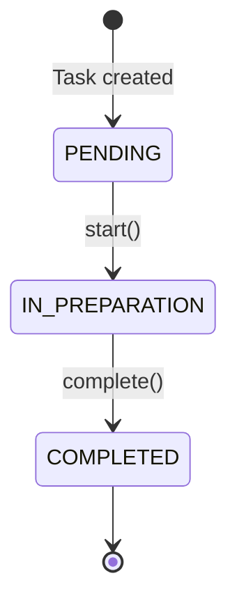

The `StartTaskPreparationUseCase` initiates the preparation of a task by updating its status and executing the corresponding preparation command asynchronously using Project Reactor.

## Input Port

The use case implements the `StartTaskPreparationPort` interface:

```java
public interface StartTaskPreparationPort {
    Task execute(Long taskId);
}
```

## Implementation

```java StartTaskPreparationUseCase.java
package com.foodtech.kitchen.application.usecases;

import com.foodtech.kitchen.application.exepcions.TaskNotFoundException;
import com.foodtech.kitchen.application.ports.in.StartTaskPreparationPort;
import com.foodtech.kitchen.application.ports.out.CommandExecutor;
import com.foodtech.kitchen.application.ports.out.TaskRepository;
import com.foodtech.kitchen.domain.commands.Command;
import com.foodtech.kitchen.domain.model.Task;
import com.foodtech.kitchen.domain.services.CommandFactory;
import org.springframework.stereotype.Service;
import reactor.core.publisher.Mono;
import reactor.core.scheduler.Schedulers;

@Service
public class StartTaskPreparationUseCase implements StartTaskPreparationPort {

    private final TaskRepository taskRepository;
    private final CommandFactory commandFactory;
    private final CommandExecutor commandExecutor;

    public StartTaskPreparationUseCase(
            TaskRepository taskRepository,
            CommandFactory commandFactory,
            CommandExecutor commandExecutor
    ) {
        this.taskRepository = taskRepository;
        this.commandFactory = commandFactory;
        this.commandExecutor = commandExecutor;
    }

    @Override
    public Task execute(Long taskId) {
        Task task = taskRepository.findById(taskId)
                .orElseThrow(() -> new TaskNotFoundException(taskId));

        task.start();
        Task savedTask = taskRepository.save(task);

        // Execute command asynchronously
        Mono.fromRunnable(() -> {
                    Command command = commandFactory.createCommand(
                            savedTask.getStation(),
                            savedTask.getProducts()
                    );
                    commandExecutor.execute(command);
                })
                .subscribeOn(Schedulers.boundedElastic())
                .doOnSuccess(unused -> {
                    Task completedTask = taskRepository.findById(taskId)
                            .orElseThrow(() -> new TaskNotFoundException(taskId));
                    completedTask.complete();
                    taskRepository.save(completedTask);
                    System.out.println("✅ [REACTOR] Task " + taskId + " completed");
                })
                .doOnError(error -> {
                    System.err.println("❌ [REACTOR] Error in task " + taskId);
                    error.printStackTrace();
                })
                .subscribe();

        return savedTask;
    }
}
```

## Use Case Flow

<Steps>
  <Step title="Retrieve Task">
    Load the task from `TaskRepository` using the provided `taskId`. If not found, throw `TaskNotFoundException`.
  </Step>
  
  <Step title="Start Task">
    Call `task.start()` which transitions the task from `PENDING` to `IN_PREPARATION` and records the start timestamp.
  </Step>
  
  <Step title="Persist State Change">
    Save the updated task to the repository with its new status and `startedAt` timestamp.
  </Step>
  
  <Step title="Create Command">
    Use `CommandFactory` to create a station-specific command (e.g., `PrepareDrinkCommand`, `PrepareHotDishCommand`).
  </Step>
  
  <Step title="Execute Asynchronously">
    Execute the command asynchronously using Project Reactor:
    - Run on `boundedElastic()` scheduler for blocking operations
    - On success: mark task as `COMPLETED`
    - On error: log the error (future enhancement could retry or alert)
  </Step>
  
  <Step title="Return Task">
    Immediately return the task in `IN_PREPARATION` status to the caller (non-blocking).
  </Step>
</Steps>

## State Transitions



## Task Domain Behavior

The `Task` entity enforces valid state transitions:

```java
public void start() {
    if (this.status != TaskStatus.PENDING) {
        throw new IllegalStateException("Task must be in PENDING status to start");
    }
    this.status = TaskStatus.IN_PREPARATION;
    this.startedAt = LocalDateTime.now();
}

public void complete() {
    if (this.status != TaskStatus.IN_PREPARATION) {
        throw new IllegalStateException("Task must be in IN_PREPARATION status to complete");
    }
    this.status = TaskStatus.COMPLETED;
    this.completedAt = LocalDateTime.now();
}
```

## Asynchronous Processing

<Info>
  The use case uses **Project Reactor** for asynchronous command execution. The caller receives an immediate response with the task in `IN_PREPARATION` status, while the actual command execution happens in the background.
</Info>

### Why Async?

- **Non-blocking**: The API can handle multiple requests without waiting for task completion
- **Realistic simulation**: Mimics real kitchen equipment that takes time to prepare items
- **Scalability**: Allows the system to queue many tasks without blocking threads

## Example Usage

```java
StartTaskPreparationPort startTask = new StartTaskPreparationUseCase(
    taskRepository,
    commandFactory,
    commandExecutor
);

// Start task #15
Task task = startTask.execute(15L);

System.out.println("Task status: " + task.getStatus()); // IN_PREPARATION
System.out.println("Started at: " + task.getStartedAt()); // 2026-03-06T10:30:15

// Task will complete asynchronously in the background
// The command executor simulates preparation time based on station type
```

## Exceptions

<Warning>
  **TaskNotFoundException**: Thrown if the provided `taskId` doesn't exist in the repository.
  
  **IllegalStateException**: Thrown by `task.start()` if the task is not in `PENDING` status (already started or completed).
</Warning>

## Dependencies

<CardGroup cols={3}>
  <Card title="TaskRepository" icon="database">
    Loads and saves task state
  </Card>
  <Card title="CommandFactory" icon="industry">
    Creates station-specific commands
  </Card>
  <Card title="CommandExecutor" icon="play">
    Executes commands (simulates kitchen equipment)
  </Card>
</CardGroup>

## Related

- [Task Model](/domain/task)
- [Command Pattern](/architecture/command-pattern)
- [Stations](/domain/stations)
- [Get Tasks by Station](/use-cases/get-tasks-by-station)
